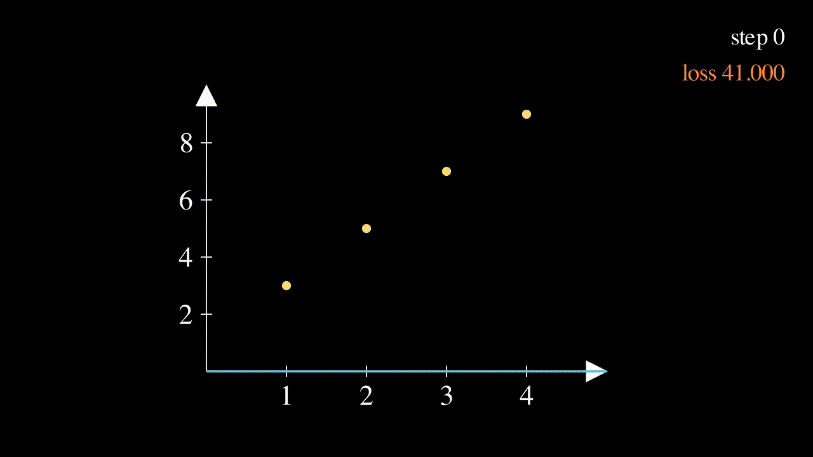
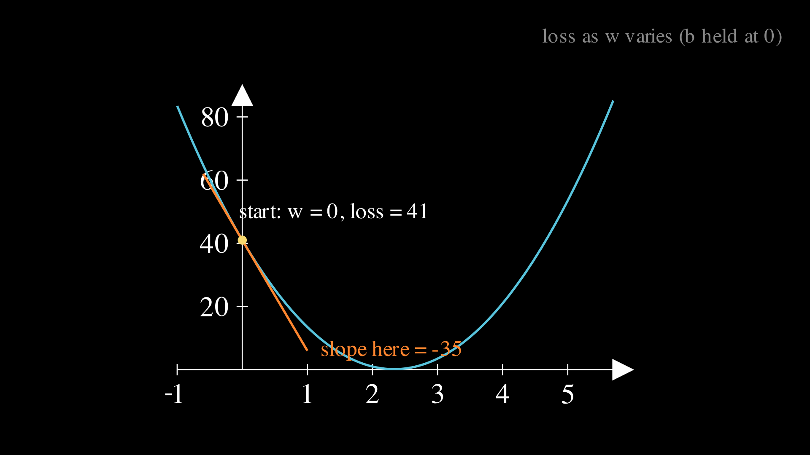
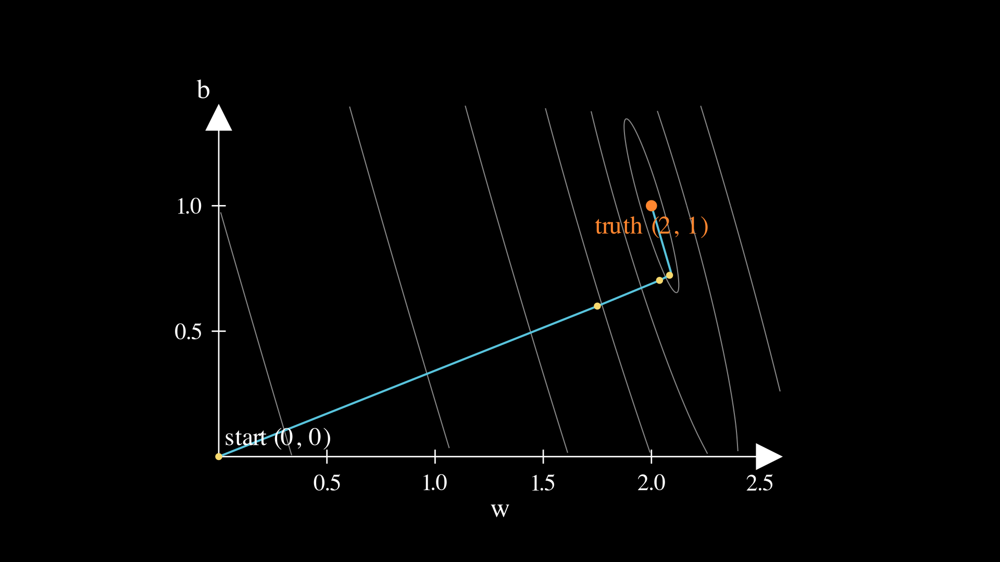

# Lesson 0001: one neuron learns a line

We are going to train the smallest neural network that exists, and we are going to do it by hand first. Not "by hand" in the hand-wavy sense of reading someone else's derivation and nodding along, but literally: paper, a four-function calculator, and every multiplication written out. Then we make numpy, torch, and a Go library reproduce our arithmetic, with `assert` statements standing guard over every number. If you finish this lesson, you will have personally executed the exact algorithm that trains GPT-class models, because at the bottom it really is this small.

Here is the whole lesson in one animation: a line that starts flat and ignorant, and learns.



The model has one weight and one bias. The dataset has four points. The whole training run we do on paper is three steps. And yet every concept that matters shows up: a model, a loss, a gradient, the chain rule, a learning rate, and the two classic ways training blows up. Everything after this lesson is this lesson with more knobs.

## The problem

Someone hands you four measurements:

```
x:  1   2   3   4
y:  3   5   7   9
```

There is a rule hiding in there. You can probably see it (each y is twice the x plus one), but the machine cannot see anything. Our job is to build a machine that discovers the rule using only the data.

The machine is a [model](https://en.wikipedia.org/wiki/Statistical_model), which is a formula with adjustable knobs:

$$\hat{y} = w x + b$$

Read $`\hat{y}`$ ("y hat") as "the model's guess at y". This particular model is a line, so what we are doing has an old and respectable name, [linear regression](https://en.wikipedia.org/wiki/Linear_regression), but do not let the name fool you into thinking it is a different subject. A neuron in a neural network computes exactly this, a weighted input plus a bias, and this lesson's model is a genuine single neuron, just not yet wearing the activation function it picks up in lesson 0002.

The knobs $`w`$ (a weight) and $`b`$ (a bias) start at zero, which means the model starts by answering 0 to every question. Training is the process of turning the knobs until the guesses match the data, and the whole trick is that the data itself will tell us which way to turn them.

## Measuring wrongness: the loss

To improve, we first need "wrong" as a single number, so that "better" simply means "smaller". Start with the error on each point, guess minus truth:

```
e = y_hat - y = [0-3, 0-5, 0-7, 0-9] = [-3, -5, -7, -9]
```

Now squash the four errors into one number. The standard recipe is to square each error and take the average, which is called the [mean squared error](https://en.wikipedia.org/wiki/Mean_squared_error):

$$L = \frac{1}{N}\sum_{i=1}^{N} (\hat{y}_i - y_i)^2$$

Squaring does two useful things: it makes overshooting and undershooting equally bad (both become positive), and it punishes big misses much harder than small ones. On our data:

```
squares:  (-3)^2 + (-5)^2 + (-7)^2 + (-9)^2 = 9 + 25 + 49 + 81 = 164
loss:     L = 164 / 4 = 41
```

Our starting loss is exactly 41. Remember that number; it is the first thing every implementation in this lesson must reproduce. A number like this, measuring total wrongness, is called a [loss function](https://en.wikipedia.org/wiki/Loss_function), and training means driving it toward zero.

## Which way to turn the knob: measure the slope

Should $`w`$ go up or down? Here is the dumbest experiment that answers it: nudge $`w`$ a tiny bit, recompute the loss, and see what happened. Set w = 0.001, keep b = 0:

```
y_hat = [0.001, 0.002, 0.003, 0.004]
e     = [-2.999, -4.998, -6.997, -8.996]
L     = (8.994001 + 24.980004 + 48.958009 + 80.928016) / 4 = 40.9650075
```

The loss moved from 41 to 40.9650075 when $`w`$ moved by 0.001. The rate of exchange:

```
slope = (40.9650075 - 41) / 0.001 = -34.9925
```

Read it plainly: around w = 0, each unit of w-increase buys about 35 units of loss-decrease. So $`w`$ should go up. This slope is a [derivative](https://en.wikipedia.org/wiki/Derivative), and the notation

$$\frac{\partial L}{\partial w} = \lim_{h \to 0} \frac{L(w+h) - L(w)}{h}$$

means nothing more mysterious than the experiment we just ran, taken to the limit of an infinitely small nudge. Here is the picture: hold b at 0 and the loss traces a bowl as w varies, and we just measured the steepness of that bowl at our starting point.



Do the same nudge on $`b`$ and you will measure -11.999. Together the two slopes form the [gradient](https://en.wikipedia.org/wiki/Gradient), the full list of "which way is downhill" for every knob at once.

## The same slope without the experiment: the chain rule

Nudging works, but it costs one full loss computation per knob, and GPT-2 has 124 million knobs. The [chain rule](https://en.wikipedia.org/wiki/Chain_rule) gets the exact slope straight from the formula.

Take the single point (x = 2, y = 5) at w = 0, b = 0. Its share of the loss is $`e^2`$ where $`e = wx + b - y = -5`$. Break the question into two easy slopes and multiply them:

```
slope of e^2 with respect to e:  2*e        (at e = -5, that is -10)
slope of e with respect to w:    x          (raising w by a hair h raises e by h*x)

chain them:  2 * e * x = 2 * (-5) * 2 = -20
```

That is the entire chain rule: when a change flows through stages, the slopes of the stages multiply. Averaging the per-point slopes gives the exact gradients, as formulas:

$$\frac{\partial L}{\partial w} = \frac{2}{N}\sum_{i=1}^{N} e_i x_i \qquad \frac{\partial L}{\partial b} = \frac{2}{N}\sum_{i=1}^{N} e_i$$

Now all four points, by hand:

```
2*e*x per point:  2*(-3)*1 = -6    2*(-5)*2 = -20    2*(-7)*3 = -42    2*(-9)*4 = -72
dL/dw = (-6 - 20 - 42 - 72) / 4 = -140 / 4 = -35

2*e per point:    -6   -10   -14   -18
dL/db = (-6 - 10 - 14 - 18) / 4 = -48 / 4 = -12
```

The nudge experiment said -34.9925 and the formula says exactly -35; the small gap is just the nudge not being infinitely small. We derived our first gradients and cross-checked them against a direct experiment. From here on we trust the formulas, because we watched them agree with reality.

## The update rule

The slope points uphill, we want downhill, so we step against it, and only a little, because the slope was measured here and is only honest nearby:

$$w \leftarrow w - \mathrm{lr}\cdot\frac{\partial L}{\partial w} \qquad b \leftarrow b - \mathrm{lr}\cdot\frac{\partial L}{\partial b}$$

The step size $`\mathrm{lr}`$ is the [learning rate](https://en.wikipedia.org/wiki/Learning_rate), and this lesson uses lr = 0.05. This procedure, step against the gradient and repeat, is [gradient descent](https://en.wikipedia.org/wiki/Gradient_descent), and it is not an ingredient of training, it is training. Everything below is just this rule applied over and over.

## Three steps, fully by hand

Get out the calculator. Step 1 is free since we have everything already:

```
L = 41,  dL/dw = -35,  dL/db = -12
w <- 0 - 0.05 * (-35) = 1.75
b <- 0 - 0.05 * (-12) = 0.60
```

Step 2, at w = 1.75, b = 0.6:

```
y_hat = [2.35, 4.10, 5.85, 7.60]
e     = [-0.65, -0.90, -1.15, -1.40]
L     = (0.4225 + 0.81 + 1.3225 + 1.96) / 4 = 4.515 / 4 = 1.12875

dL/dw = (2*(-0.65)*1 + 2*(-0.90)*2 + 2*(-1.15)*3 + 2*(-1.40)*4) / 4 = -23.0 / 4 = -5.75
dL/db = (2*(-0.65) + 2*(-0.90) + 2*(-1.15) + 2*(-1.40)) / 4 = -8.2 / 4 = -2.05

w <- 1.75 + 0.2875 = 2.0375
b <- 0.60 + 0.1025 = 0.7025
```

The loss fell from 41 to 1.12875 in a single step. Step 3, at w = 2.0375, b = 0.7025:

```
y_hat = [2.7400, 4.7775, 6.8150, 8.8525]
e     = [-0.2600, -0.2225, -0.1850, -0.1475]
L     = (0.0676 + 0.04950625 + 0.034225 + 0.02175625) / 4 = 0.043271875
```

Three losses: 41, then 1.12875, then 0.043271875. You just trained a neural network by hand.

Now look at what the knobs did. $`w`$ raced from 0 to 2.0375, already past the true value of 2, while $`b`$ is only at 0.7025, well short of 1. That asymmetry is real and worth staring at: $`w`$ gets multiplied by x in every prediction, so the loss is far more sensitive to it, so its gradient is bigger, so it moves faster. Here is the whole journey of the pair (w, b) across the loss landscape, the first steps marked with dots:



One giant diagonal leap, an overshoot past w = 2, and then a long patient crawl up the narrow valley while $`b`$ catches up. The curved grey lines are level curves of the loss, like altitude lines on a hiking map, and that narrow diagonal valley is your first glimpse of why training big models is hard: real loss landscapes are made of millions of valleys like this one.

## Now make the machines agree with your paper

This is the part that makes the lesson stick. The code's first job is not to train anything, it is to reproduce your paper, and every hand-computed number sits behind an `assert`:

```python
if step == 1:
    assert loss == 41.0 and dw == -35.0 and db == -12.0
if step == 2:
    assert abs(loss - 1.12875) < 1e-9
if step == 3:
    assert abs(loss - 0.043271875) < 1e-9
```

Step 1 is asserted with exact equality because everything in it is integer arithmetic, which floats represent perfectly. Steps 2 and 3 get a tolerance because 0.05 has no exact binary representation (see [how floats work](https://en.wikipedia.org/wiki/Double-precision_floating-point_format) if that sentence is surprising; it surprises everyone once). If an assert fires, your paper or your typing is wrong, and finding out which one is precisely the skill this course is built to teach.

Three ways to run it, pick whichever is nearest:

**Locally.** Any machine with python works, and with [uv](https://docs.astral.sh/uv/) there is nothing to set up: `uv run train.py` from this folder (uv reads the repo's pyproject and provides numpy). Plain `python3 train.py` is fine too if you have numpy. Expected output ends with `final w 2.004774 b 0.985965`, a whisper away from the hidden truth of 2 and 1.

**On Google Colab.** Open [lesson.ipynb in Colab](https://colab.research.google.com/github/tamnd/soroban/blob/main/lessons/0001-one-neuron/lesson.ipynb), then Runtime, Run all. Everything the notebook needs (numpy, torch, matplotlib) is preinstalled on Colab, so there is genuinely nothing to set up, and the free CPU runtime is plenty for four data points.

**On a real GPU box.** Same commands, and for this lesson the GPU will do exactly nothing, which is itself the point: the algorithm does not know or care what hardware it runs on. This repo's lessons are tested on a single RTX 4090 machine, and the GPU starts mattering at lesson 0007 when the models get big enough to feed it.

## Torch computes the gradient without being told the formula

We derived $`\frac{\partial L}{\partial w} = \frac{2}{N}\sum e_i x_i`$ by hand. [Automatic differentiation](https://en.wikipedia.org/wiki/Automatic_differentiation) is that derivation performed mechanically: torch records every operation used to build the loss into a graph, then walks the graph backwards applying the chain rule at each node, which is why the procedure is called [backpropagation](https://en.wikipedia.org/wiki/Backpropagation).

```python
import torch

x = torch.tensor([1.0, 2.0, 3.0, 4.0])
y = torch.tensor([3.0, 5.0, 7.0, 9.0])
w = torch.zeros(1, requires_grad=True)
b = torch.zeros(1, requires_grad=True)

loss = ((w * x + b - y) ** 2).mean()
loss.backward()
print(loss.item(), w.grad.item(), b.grad.item())   # 41.0 -35.0 -12.0
```

Nobody typed the gradient formula anywhere in that script, and out come your numbers. Run it with `uv run train.py --torch`, or just run the notebook, where this cell is included.

## The Go version, or why this repo has a `grad/` package

At the root of this repo lives a tiny Go library: [`grad`](../../grad) is a from-scratch scalar autograd engine (about a hundred lines, and you can read all of them), and [`nn`](../../nn) builds a neuron on top of it. Lesson 0001 is their first customer:

```
go test ./...               # the tests assert 41, -35, -12, 1.12875, 0.043271875
go run ./cmd/soroban list   # see all lessons implemented in Go
go run ./cmd/soroban 0001   # prints the same table as train.py, byte for byte
```

The same hand numbers now hold in three independent implementations, which gives you a debugging superpower for the rest of the course: when your arithmetic disagrees with one implementation, you check it against another, and the odd one out is the one that is wrong.

## Break it on purpose

The learning rate is a bet about how far the slope stays honest, and the way to understand a bet is to lose it. Rerun with bigger steps (`uv run train.py --lr 0.1`, then `--lr 0.2`) and watch the first five losses:

| lr | first five losses | signature |
|----|-------------------|-----------|
| 0.05 | 41, 1.13, 0.04, 0.01, 0.01 | smooth descent |
| 0.1 | 41, 18.41, 8.27, 3.72, 1.68 | oscillating descent |
| 0.2 | 41, 224, 1229, 6731, 36859 | divergence |

At lr = 0.1 look at the error signs: they flip every step, which is what overshooting the bottom of the valley and landing on the opposite wall looks like, and it still converges because each overshoot lands lower than the last. At lr = 0.2 each overshoot lands higher than it started, the feedback compounds, and the loss runs off to infinity. Keep both shapes in your head. A real training run whose loss spikes and climbs is that third row wearing a trillion-parameter costume, and diagnosing it starts with exactly this picture.

## Exercises

1. Delete the factor 2 from both gradient formulas and rerun. Predict the outcome before running.
2. Delete $`b`$ from the model entirely, so $`\hat{y} = wx`$, and run 400 steps. The loss stops falling at a floor. Predict the floor, then compute it exactly.
3. Make the data noisy, `y = [3.1, 4.8, 7.2, 8.9]`, and rerun. Where does the loss end up, and is that a failure?

Answers, but genuinely try first. (1) Still converges, half as fast: dropping the 2 is identical to halving the learning rate, and any constant factor on the gradient gets silently absorbed into lr, which is why different textbooks disagree about such factors and nothing breaks. (2) The floor is exactly 1/6, reached at w = 7/3: without a bias the best line through the origin is $`w = \sum x_i y_i / \sum x_i^2 = 70/30`$, and the leftover error is irreducible. The lesson generalizes: a loss floor can mean your model cannot represent the answer, and no amount of training fixes that. You can even spot it in the slope figure above, whose bowl bottoms out near w = 2.33 at a height visibly above zero. (3) The loss floors at a small nonzero value, and that is not failure, that is the noise itself; a model reaching zero loss on noisy data would be memorizing the noise, a disease called [overfitting](https://en.wikipedia.org/wiki/Overfitting) that gets its own lesson later.

## Exit test

Fresh data: (1, 4), (2, 7), (3, 10). Start at w = 0, b = 0, lr = 0.05, and note N = 3 now. On paper, compute the starting loss and both gradients, apply one update, and compute the new loss. Then point `train.py` at the new data and make the asserts match your paper.

Check yourself: L = 55, dL/dw = -32, dL/db = -14, then w = 1.6, b = 0.7, and the new loss is 32.75/3, which is 10.916667. If your paper agrees and your modified asserts pass, this lesson is done.

## What is next

Lesson 0002 gives the neuron a friend and a [nonlinearity](https://en.wikipedia.org/wiki/Activation_function), because there are shapes in data that no single line can fit, and the chain rule grows its second link. The loop you just executed by hand never changes again.

A note on the figures: they are generated from [`visuals.py`](visuals.py) with [manim](https://github.com/manimCommunity/manim), the animation engine behind 3Blue1Brown's videos, and the rendered files are committed in [`assets/`](assets) so you never need manim installed to read the lesson. The file's docstring has the regeneration commands if you want to tinker.
