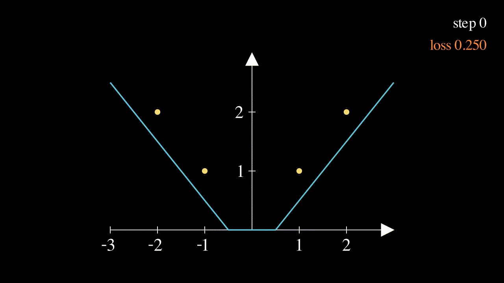
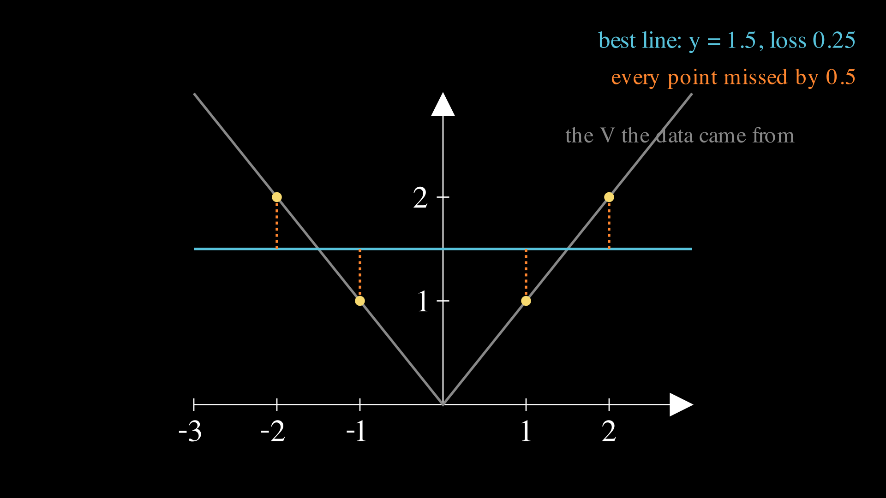
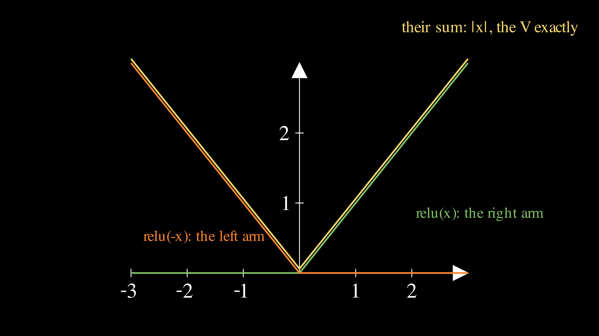

# Lesson 0002: a hidden layer learns a V

Lesson 0001 trained one neuron, and one neuron is a line. This lesson hands the model a problem no line can solve, watches it fail, and then fixes it with the two ideas that turn a line into a neural network: a hidden layer and an activation function. Same routine as before: every number by hand first, then numpy, torch, and the Go library reproduce the paper under `assert` guard.

Here is the finished lesson in one animation: a bent line that starts in the wrong place, and learns.



The model grows from two knobs to seven, and the chain rule grows its second link. Those are the only two changes. The loop from lesson 0001, forward, loss, backward, update, is untouched, and it stays untouched for the rest of the course.

## The wall

Four new measurements:

```
x:  -2  -1   1   2
y:   2   1   1   2
```

The rule this time is $`y = |x|`$, the absolute value, whose graph is a V with its corner at the origin (bars new to you? the [notation page](../../maths/notation.md) has them). The V is the shortest function that defeats lesson 0001's model, and it is worth being precise about what "defeats" means. It does not mean the line fits badly. It means we can compute the best any line could ever do, and watch it fall short.

The data is symmetric: for every point on the left there is a mirror point on the right at the same height. A line with any tilt does better on one side and worse on the other by the same amount, so tilting cannot help, and the best line is flat: $`\hat{y} = b`$. The best flat line sits at the average height, $`b = (2+1+1+2)/4 = 1.5`$, and its [mean squared error](../../maths/mean-squared-error.md) is

```
e = [1.5-2, 1.5-1, 1.5-1, 1.5-2] = [-0.5, 0.5, 0.5, -0.5]
L = (0.25 + 0.25 + 0.25 + 0.25) / 4 = 0.25
```

Every point missed by exactly 0.5, loss 0.25, and no knob turning can do better, because we did not pick a bad line, we picked the champion:



This is a loss floor of the worst kind, the kind from lesson 0001's exercise 2: the model family cannot represent the answer, and gradient descent, which only ever tunes knobs within the family, cannot escape it. To fit a corner we need a model that can bend.

## The fix: relu, a switch that bends lines

The [relu page](../../maths/relu.md) tells the full story; here is the working minimum. An activation function is a fixed nonlinear function applied to a neuron's output, and the standard one is relu:

$$\mathrm{relu}(z) = \max(0, z)$$

In words: positive inputs pass through unchanged, negative inputs become 0. A neuron wearing relu is a line with a switch: on where its line is positive, flat zero where it is negative. One such neuron has one kink. Two of them can make a V, and there is an identity that says so exactly:

$$\mathrm{relu}(x) + \mathrm{relu}(-x) = |x|$$

Check it: at $`x = 2`$ the first term is 2 and the second is $`\mathrm{relu}(-2) = 0`$; at $`x = -2`$ the first is 0 and the second is $`\mathrm{relu}(2) = 2`$. Whatever the sign of $`x`$, one relu is asleep and the other reports the distance from zero. Each relu owns one arm:



So the architecture for this lesson is a hidden layer of two relu neurons feeding one plain output neuron:

$$\hat{y} = v_1 \, \mathrm{relu}(w_1 x + b_1) + v_2 \, \mathrm{relu}(w_2 x + b_2) + c$$

In words: neuron 1 computes its line $`w_1 x + b_1`$ and switches it through relu, neuron 2 does the same with its own line, and the output neuron mixes the two results with weights $`v_1, v_2`$ and adds its bias $`c`$. The hidden layer is called hidden because its outputs are internal scaffolding; the data never says what they should be, and training has to invent a job for each neuron on its own. Seven knobs now: $`w_1, b_1, w_2, b_2, v_1, v_2, c`$.

## The starting position

Lesson 0001 started at zero. Here zero init kills the model outright (you will prove this in the failure gallery below, and it is the reason real networks start random), and true random numbers would make your paper and this page disagree. So the lesson fixes a starting position chosen for clean arithmetic:

```
w1 = 1     b1 = -0.5      (neuron 1: a right arm, at the wrong height)
w2 = -1    b2 = -0.5      (neuron 2: a left arm, at the wrong height)
v1 = 1     v2 = 1   c = 0
```

Each hidden neuron already leans toward one arm of the V, but shifted down by 0.5, so the model starts wrong everywhere and training has real work to do. Every number that follows is a half or a quarter, which floats store exactly, so your calculator and the machine must agree to the last digit.

## Forward, by hand

Run the four inputs through. Neuron 1 first, $`z_1 = x - 0.5`$, then the switch:

```
z1 = [-2.5, -1.5, 0.5, 1.5]
h1 = relu(z1) = [0, 0, 0.5, 1.5]      (off, off, on, on)
```

Neuron 2, $`z_2 = -x - 0.5`$:

```
z2 = [1.5, 0.5, -1.5, -2.5]
h2 = relu(z2) = [1.5, 0.5, 0, 0]      (on, on, off, off)
```

Notice the division of labor already present: neuron 1 is awake only on the right side, neuron 2 only on the left. Output neuron, $`\hat{y} = h_1 + h_2 + 0`$:

```
y_hat = [1.5, 0.5, 0.5, 1.5]
e     = y_hat - y = [-0.5, -0.5, -0.5, -0.5]
L     = 4 * 0.25 / 4 = 0.25
```

Starting loss exactly 0.25, which is exactly the line's floor. The bent model starts no better than the best line, and everything from here on is it earning its keep.

## The backward pass grows a second link

We need seven slopes now, and the [chain rule](../../maths/chain-rule.md) handles them all with one new ingredient. The output neuron's knobs work like lesson 0001, nothing new:

```
dL/dc  = 2 * mean(e)                 = 2 * (-0.5)  = -1
dL/dv1 = 2 * mean(e * h1) = 2 * mean([0, 0, -0.25, -0.75]) = -0.5
dL/dv2 = 2 * mean(e * h2) = 2 * mean([-0.75, -0.25, 0, 0]) = -0.5
```

The interesting knobs are the hidden ones. Take $`w_1`$ and one point, and follow the change through every stage it touches: a nudge to $`w_1`$ moves $`z_1`$ at rate $`x`$, moves $`h_1`$ at the rate of relu's slope, moves $`\hat{y}`$ at rate $`v_1`$, and moves that point's loss at rate $`2e`$. The chain rule multiplies the stages:

$$\frac{\partial L_i}{\partial w_1} = 2 e_i \cdot v_1 \cdot g_{1,i} \cdot x_i$$

The new ingredient is $`g_1`$, relu's slope, and it is the friendliest slope in the course: 1 where the neuron is on, 0 where it is off. It acts as a gate. When the gate is open the chain passes through as if relu were not there, and when the gate is shut the whole product is zero, meaning that data point teaches this neuron nothing. Off the step-1 forward pass:

```
g1 = [0, 0, 1, 1]         g2 = [1, 1, 0, 0]
```

Each hidden neuron learns only from the points it is awake for. Now the hand arithmetic, per point then averaged, remembering $`v_1 = 1`$:

```
2*e*v1*g1*x per point:  0    0    2*(-0.5)*1*1 = -1    2*(-0.5)*1*2 = -2
dL/dw1 = (0 + 0 - 1 - 2) / 4 = -0.75

2*e*v1*g1 per point:    0    0    -1    -1
dL/db1 = -2 / 4 = -0.5
```

Same recipe for neuron 2 with its own gate, where the x values are negative:

```
2*e*v2*g2*x per point:  2*(-0.5)*1*(-2) = 2    2*(-0.5)*1*(-1) = 1    0    0
dL/dw2 = 3 / 4 = 0.75
dL/db2 = (-1 - 1 + 0 + 0) / 4 = -0.5
```

Seven slopes, all clean quarters and halves:

```
dw1 = -0.75   db1 = -0.5   dw2 = 0.75   db2 = -0.5
dv1 = -0.5    dv2 = -0.5   dc  = -1
```

A sanity read before moving on: every error is negative (all guesses too low), so the model wants to push everything up, and indeed almost every slope is negative, meaning the update below will raise those knobs. The one positive slope, $`dw_2 = +0.75`$, passes the same check: neuron 2 lives on the left where x is negative, so to guess higher there its weight must go more negative, and a positive slope is what pushes a knob down.

## One update, then the machine takes over

The [update rule](../../maths/gradient-descent.md) is unchanged, seven knobs instead of two, lr = 0.1:

```
w1 <- 1    - 0.1*(-0.75) = 1.075     b1 <- -0.5 - 0.1*(-0.5) = -0.45
w2 <- -1   - 0.1*(0.75)  = -1.075    b2 <- -0.5 - 0.1*(-0.5) = -0.45
v1 <- 1    - 0.1*(-0.5)  = 1.05      v2 <- 1    - 0.1*(-0.5) = 1.05
c  <- 0    - 0.1*(-1)    = 0.1
```

Run the forward pass once more at the new knobs to see what the step bought. Spot-check two points on paper: at $`x = 2`$, $`z_1 = 1.7`$, $`z_2 = -2.6`$, so $`\hat{y} = 1.05 \cdot 1.7 + 0 + 0.1 = 1.885`$ and $`e = -0.115`$; at $`x = 1`$, $`z_1 = 0.625`$, $`z_2 = -1.525`$, so $`\hat{y} = 1.05 \cdot 0.625 + 0.1 = 0.75625`$ and $`e = -0.24375`$. By symmetry the left side mirrors the right, and the new loss is

```
L = 2 * (0.115^2 + 0.24375^2) / 4 = 0.03631953125
```

From 0.25 to 0.0363 in one step, and the line's unbeatable floor is already far overhead. The gates have not moved (same neurons awake on the same points), but every knob has, and from here the loop repeats without novelty. The full run at lr = 0.1 for 300 steps prints:

```
step   1  loss 0.250000000
step   2  loss 0.036319531
step   3  loss 0.011582498
step  10  loss 0.006811121
step  50  loss 0.000992101
step 300  loss 0.000000013
final     w1 1.036709  b1 -0.335362  w2 -1.036709  b2 -0.335362  v1 0.964803  v2 0.964803  c 0.323205
```

Look at the final knobs before moving on, because they are the payoff of the whole lesson: $`w_2 = -w_1`$ and $`b_2 = b_1`$ to six decimal places, and $`v_1 = v_2`$. Training rediscovered the two-arm identity on its own, one neuron per arm, mirror images of each other, without anyone telling it the V was symmetric. It found a scaled and shifted variant rather than the tidy textbook one (there are infinitely many parameter settings that make this V, another new fact of life with hidden layers), but the structure is unmistakable.

## Make the machines agree with your paper

Same discipline as lesson 0001. The asserts in [`train.py`](train.py) pin the code to the paper:

```python
if step == 1:
    assert loss == 0.25
    assert (dw1, db1, dw2, db2) == (-0.75, -0.5, 0.75, -0.5)
    assert (dv1, dv2, dc) == (-0.5, -0.5, -1.0)
if step == 2:
    assert abs(loss - 0.03631953125) < 1e-9
if step == 3:
    assert abs(loss - 0.01158249795541518) < 1e-9
```

Step 1 uses exact equality because its arithmetic never leaves the halves and quarters, which floats store perfectly. The moment lr = 0.1 touches the knobs, a tenth's tiny representation error rides along, so later steps compare with a tolerance; the [floats page](../../maths/floats.md) explains exactly which decimals a computer stores exactly and why 0.1 is not among them.

Three ways to run it:

**Locally.** From this folder, `uv run train.py`, or plain `python3 train.py` if you have numpy. Expected output is the table above. Try `--lr 0.5` afterward; there is a surprise waiting there that the failure gallery below explains.

**On Google Colab.** Open [lesson.ipynb in Colab](https://colab.research.google.com/github/tamnd/soroban/blob/main/lessons/0002-hidden-layer/lesson.ipynb), then Runtime, Run all. Nothing to install.

**On a real GPU box.** Same commands, same shrug from the GPU: seven knobs do not wake a 4090 up. The lessons are verified on one anyway, because the habit of running every lesson on the real hardware is cheap now and priceless later.

## Torch does the seven-slope backward pass for free

In lesson 0001 [automatic differentiation](../../maths/autodiff.md) felt like a party trick, two slopes we could derive in a minute. Watch what it is worth now. The backward section above took real care: a second chain link, a gate per neuron, seven formulas. Torch gets all seven from the forward formula alone:

```python
import torch

x = torch.tensor([-2.0, -1.0, 1.0, 2.0])
y = torch.tensor([2.0, 1.0, 1.0, 2.0])
p = {name: torch.tensor([val], requires_grad=True)
     for name, val in [("w1", 1.0), ("b1", -0.5), ("w2", -1.0), ("b2", -0.5),
                       ("v1", 1.0), ("v2", 1.0), ("c", 0.0)]}

y_hat = (p["v1"] * torch.relu(p["w1"] * x + p["b1"])
         + p["v2"] * torch.relu(p["w2"] * x + p["b2"]) + p["c"])
loss = ((y_hat - y) ** 2).mean()
loss.backward()
```

Run it with `uv run --extra torch train.py --torch`: the script asserts that all seven of torch's gradients equal your hand numbers exactly, not approximately. Growing the model cost us seven hand derivations; it cost torch nothing, and that exchange rate is the entire reason autodiff exists.

## The Go version grows a layer

The [`grad`](../../grad) engine gained its first activation this lesson, `Relu()`, a dozen lines including the gate, and [`nn`](../../nn) gained a `Layer`, which is nothing but a slice of neurons asked in a row. The tests pin the same numbers as the python asserts, plus one this page promised: that the two neurons end as mirror images.

```
go test ./...               # asserts 0.25, all seven gradients, 0.0363..., mirror-image finish
go run ./cmd/soroban 0002   # prints the same loss table as train.py, byte for byte
```

Three implementations, one set of hand numbers, same debugging superpower as before: when implementations disagree, the odd one out is wrong, and when all three disagree with your paper, your paper gets a second look.

## Break it on purpose

Lesson 0001 had two ways to fail; hidden layers add genuinely new ones. Each experiment below is one flag on `train.py`, and each is worth actually running.

**Zero init kills everything.** Lesson 0001 started at zero and trained fine, so start this model at all zeros and by the old logic it should limp somewhere. It cannot move at all, except for one knob. Trace it: with every $`w, b`$ at zero, both $`z`$ values are 0, both relu outputs are 0, both gates are shut, and every gradient in the network dies at a zero gate or a zero $`h`$, except $`dc = -3`$. Training drives $`c`$ to 1.5 and stops forever, at loss 0.25: the seven-knob bendable model reproduces the flat line exactly, with five knobs playing dead. This is why real networks initialize randomly, and why this lesson had to fix a nonzero starting position.

**Symmetric init makes clones.** Set neuron 2 equal to neuron 1 (`w2 = 1, b2 = -0.5`) and rerun. Both neurons see the same inputs, compute the same outputs, receive the same gradients, and take the same updates, so they stay identical forever. Two neurons, one kink between them, and the loss floors at 1/6, which is 0.166667. Randomness in real init is not decoration; it is what breaks this tie, and the technical name for the fix is symmetry breaking.

**The learning-rate ladder has a new rung.** Lesson 0001's ladder had smooth descent, oscillation, divergence. Run this model at lr = 0.1, 0.3, 0.5, 0.8 and watch the first five losses:

| lr | first five losses | signature |
|----|-------------------|-----------|
| 0.1 | 0.25, 0.036, 0.012, 0.009, 0.009 | smooth descent |
| 0.3 | 0.25, 0.30, 0.56, 0.39, 0.59 | oscillates, then converges anyway |
| 0.5 | 0.25, 1.73, 5.38, 0.25, 0.25 | flatlines at 0.25 forever |
| 0.8 | 0.25, 6.7, 142, 6.8e5, 3.4e17 | divergence |

Rows one, two, and four are lesson 0001's story again. Row three is new, and it is the star exhibit of this lesson. The loss is not exploding, not oscillating, not decreasing: it is pinned to 0.25, the flat line's floor, to the ninth decimal, forever. Print the gates and the diagnosis is one line: from step 3 on, both are 0 on all four points. The two violent early steps threw both neurons so far down that their lines are negative on the whole dataset, every gate is shut, every hidden gradient is exactly zero, and no future update can ever wake them, because the very gradients that would fix them are the ones being zeroed. Only $`c`$ still learns, and it walks to 1.5 and stops. This is the famous dying relu problem (the [relu page](../../maths/relu.md) names it formally), and its signature, a healthy-looking training run flatlined at a suspiciously interpretable value, is one you will meet again at scales where it costs real money.

**A dead neuron from birth.** You do not need a violent learning rate to see a shut gate; set `b2 = -5` and neuron 2 starts with its gate closed on all four points. It never learns, the survivor covers one arm alone, and the loss floors at 1/6, which is 0.166667 again. Worth noticing: this floor equals the symmetric-clone floor, two different diseases with the same symptom, because both leave the model with one usable kink when the data needs two. A loss floor tells you capacity is missing; it does not tell you why.

## The valley nobody asked for

One more experiment, and it opens the door every later lesson walks through. The trained model hits the four training points nearly perfectly. Now ask it about a point it never saw: $`x = 0.1`$, where the true V says 0.1. The model answers 0.323205. In fact, for every input between roughly -0.32 and 0.32 it answers exactly the same 0.323205, a flat valley floor between the two arms. The final knobs explain it: with $`b_1 = -0.335362`$ and $`w_1 = 1.036709`$, neuron 1's gate does not open until $`x`$ exceeds about 0.3235, neuron 2 mirrors it on the left, and between those thresholds both neurons sleep, leaving only the constant $`c`$. The data never contained a point near the corner, so no gradient ever punished the flat valley, so training kept it.

The model did not learn the V; it learned the four points, and near them anything goes. That gap between fitting data and learning the rule behind it is called generalization, it is the actual subject of machine learning (fitting is the easy half, as three lessons of watching loss hit zero should suggest), and it gets its own lesson when we can afford held-out data. For now, keep the picture: a perfect training loss, hiding a made-up answer half a unit wrong, a stone's throw from the data.

## Exercises

1. Predict, then run, `--lr 0.3` for 100 steps. The loss rises at step 2. Is it dying, diverging, or fine?
2. Rerun the symmetric-clone experiment but break the tie by a hair: `w2 = 0.999` instead of 1. The clones are no longer identical, so by the symmetry-breaking argument above, does training now escape the 1/6 floor?
3. The zero-init failure and the lr = 0.5 failure both end at loss 0.25 with c = 1.5. One of them could be rescued by a different learning rate; which one, and why is the other unrescuable at any learning rate?

Answers, but genuinely try first. (1) Fine, though it earns the word barely: the first five losses bounce 0.25, 0.30, 0.56, 0.39, 0.59 with no pattern a nervous person would call progress, and then the run converges anyway, under $`10^{-8}`$ by step 100. Between healthy 0.1 and lethal 0.5 there is a whole band of ugly-but-working. (2) It does not escape, and the reason teaches more than the expected yes would have. The twins do become slightly different, but both start as right arms, and a right arm's gate is shut on the entire left half of the data, so the errors at $`x = -2, -1`$, the only evidence that a left arm is needed, never produce a gradient on either neuron. To serve the left, a weight would have to cross zero, and nothing ever pushes it there; after 2000 steps the pair sits at the 1/6 floor with two nearly identical right arms. So breaking the tie is necessary but not sufficient: an init must also spread neurons across different orientations, which is exactly what the random signs in real initialization buy, and what this lesson's fixed init hand-delivers with $`w_2 = -1`$. (3) Neither can be rescued, and that is the trap in the question: both are all-gates-shut states, and once every gate is shut the hidden gradients are exactly zero at any learning rate, since lr multiplies the gradient and anything times zero is zero. The difference is only in how they got there: zero init is born dead, lr = 0.5 was beaten to death, but the coroner's report is identical. Prevention (better init, smaller lr) is the only cure this optimizer has.

## Exit test

Fresh data, same architecture, same init, same lr = 0.1:

```
x:  -1   0   2   3
y:   2   1   1   2
```

(The hidden rule is $`y = |x - 1|`$, a V with its corner moved off the origin.) On paper: run the forward pass, find both gates, compute all seven gradients, apply one update, and compute the new loss. Then point `train.py` at this data and make the asserts match your paper.

Check yourself: the forward pass gives $`\hat{y} = [0.5, 0, 1.5, 2.5]`$, errors $`[-1.5, -1, 0.5, 0.5]`$, loss 0.9375. The gates are $`g_1 = [0, 0, 1, 1]`$ and $`g_2 = [1, 0, 0, 0]`$, and the point $`x = 0`$ deserves a pause: it lands inside both dead zones, so it pushes on nothing but $`c`$, a live example of the flat-valley blindness from two sections ago. The gradients come out $`dw_1 = 1.25`$, $`db_1 = 0.5`$, $`dw_2 = 0.75`$, $`db_2 = -0.75`$, $`dv_1 = 1.0`$, $`dv_2 = -0.375`$, $`dc = -0.75`$, the update lands at $`w_1 = 0.875`$, $`b_1 = -0.55`$, $`w_2 = -1.075`$, $`b_2 = -0.425`$, $`v_1 = 0.9`$, $`v_2 = 1.0375`$, $`c = 0.075`$, and the new loss is 0.61175478515625. A long run drives the loss to zero: the off-center V is still two arms, and two neurons still suffice. If your paper agrees and your modified asserts pass, this lesson is done.

## What is next

Lesson 0003 changes the question instead of the model: from "how much" to "which one", classification, where the model must output a probability and the honest way to score a probability is a new loss called cross-entropy. The forward-loss-backward-update loop, as promised, does not change.

A note on the figures: they are generated from [`visuals.py`](visuals.py) with [manim](https://github.com/manimCommunity/manim), and the rendered files are committed in [`assets/`](assets) so you never need manim installed to read the lesson. The file's docstring has the regeneration commands.
