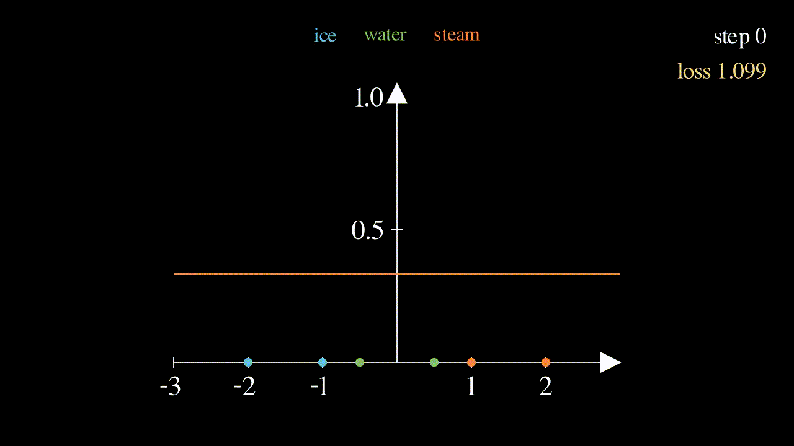
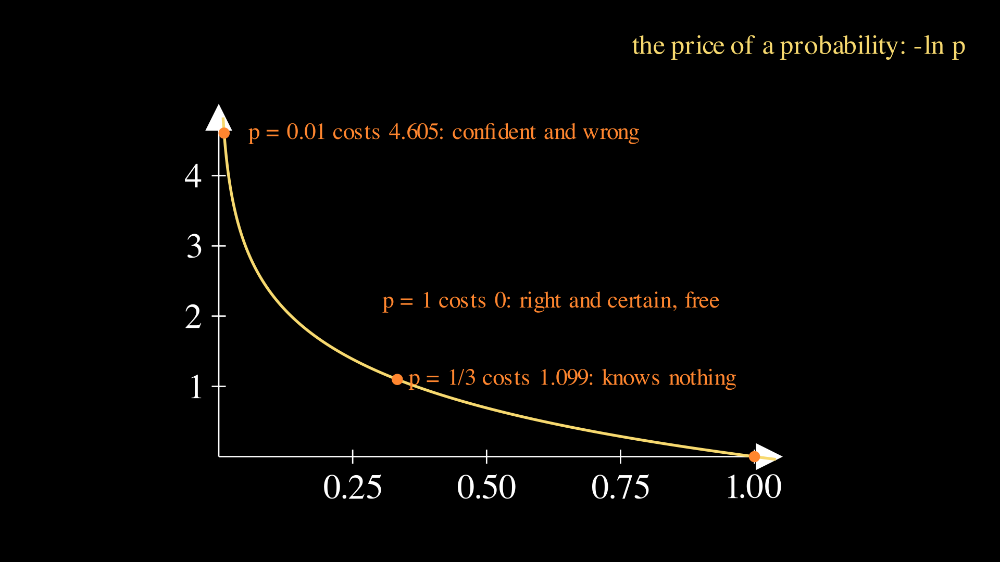
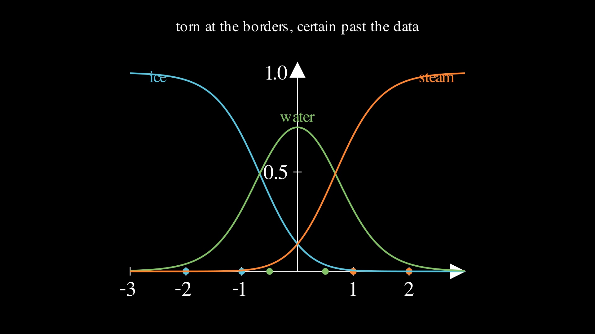

# Lesson 0003: ice, water, steam, a first classifier

Lessons 0001 and 0002 predicted numbers and were scored on distance. This lesson changes the question instead of the model: the answer is now a category, one of ice, water, or steam, and "how far off" stops making sense, because guessing steam when the truth is ice is not 2 units of wrong. Two new pieces of machinery handle it, softmax and cross-entropy, and the payoff at the center of the lesson is the friendliest gradient formula in the subject. Same routine as always: every number by hand first, then numpy, torch, and the Go library reproduce the paper under `assert` guard.

Here is the finished lesson in one animation: three probability curves that start flat at one third each, knowing nothing, and learn to carve the line into three territories.



The training loop from lesson 0001, forward, loss, backward, update, is untouched, as promised. Everything new happens in how the forward pass ends and how the loss reads it.

## The new question

Six measurements on a temperature-like axis, each labeled with a phase:

```
x:      -2     -1     -0.5    0.5    1      2
class:  ice    ice    water   water  steam  steam
```

The classes get numbers, ice = 0, water = 1, steam = 2, but the numbers are names, not quantities, and the model must not treat class 2 as "twice class 1". So instead of one output, the model produces three scores, one per class, each from its own line:

$$z_k = w_k x + b_k \qquad k = 0, 1, 2$$

Six knobs: a weight and a bias per class. The scores are called logits, and they can be any real numbers: whichever class's line is highest at a given $`x`$ is the model's leading candidate there. Deliberately, there is no hidden layer this time; the new content is in the head, and the body stays as plain as possible.

## Softmax: three scores become three probabilities

Raw scores are an awkward answer format. What we want the model to say at $`x = -0.75`$ is not "ice: 1.28, water: 1.11, steam: -2.39" (the trained model's actual scores there) but "ice 54%, water 45%, steam 1%", an honest bet. The [softmax page](../../maths/softmax.md) covers the bridge in full; here is the working minimum:

$$p_k = \frac{e^{z_k}}{e^{z_0} + e^{z_1} + e^{z_2}}$$

Exponentiate every score, which makes them all positive while keeping their order (the [exp-log page](../../maths/exp-log.md) is the refresher on $`e^x`$ and $`\ln`$), then divide each by the total so they sum to 1. Work it once on the scores $`z = (2, 0, -2)`$, calculator in hand:

```
e^z  = (7.389056, 1.000000, 0.135335)
sum  = 8.524391
p    = (0.866813, 0.117310, 0.015876)
```

A lead of 2 points in score became a lead of $`e^2 = 7.39`$ times in probability, because dividing exponentials subtracts their exponents. That observation has a sharp edge: adding the same constant to all three scores changes nothing, since it multiplies top and bottom by the same factor. Only the gaps between scores matter. The softmax page turns this shift invariance into the subtract-the-max survival trick, and the failure gallery below shows what happens to a training run that skips it.

## Cross-entropy: the price of a probability

Now the model outputs probabilities and the truth is one class, so the loss must score a bet against an outcome. Cross-entropy charges, per data point, the negative log of the probability the model gave to the class that turned out to be true:

$$L = \frac{1}{N}\sum_{i=1}^{N} -\ln(p_{\text{true},i})$$

The [cross-entropy page](../../maths/cross-entropy.md) has the full story; the shape to internalize is the price list of $`-\ln p`$:



```
p = 1     costs 0          certain and right, free
p = 0.9   costs 0.105      mild hedge, small fee
p = 0.5   costs 0.693      coin flip
p = 1/3   costs 1.099      knows nothing, three classes
p = 0.01  costs 4.605      confident and wrong, painful
p -> 0    costs infinity   certain and wrong, unbounded
```

Being roughly right is cheap, being confidently wrong is ruinous, and that asymmetry is the incentive we are about to hand the optimizer. Check the pricing on the worked example above: if the truth is class 0, the cost is $`-\ln(0.866813) = 0.142932`$; class 1 costs 2.142932; class 2 costs 4.142932. The three costs sit exactly 2 apart, the same as the score gaps, and that is worth a minute with the [notation for logs](../../maths/exp-log.md): $`-\ln p_k = \ln(\text{sum of } e^z) - z_k`$, and $`\ln(8.524391) = 2.142932`$. Cost is a constant minus your score, per point, which is the first hint that the gradients here are going to be pleasant.

## The starting position

All six knobs start at zero, lr = 0.1, and the choice is pointed. Zero init was a corpse in lesson 0002: the two hidden neurons were interchangeable, so identical starts meant identical gradients meant clones forever. Here the three rows are not interchangeable, because each has its own targets; ice's row is told "be high on the left two points", steam's the opposite, and their gradients differ from the first step even though their knobs match. Symmetry between units is broken by the data itself, and zero init is safe again.

It also buys the cleanest starting arithmetic in the repo. Every score is 0, so every point gets $`p = (1/3, 1/3, 1/3)`$, and every point costs $`-\ln(1/3) = \ln 3`$:

$$L_1 = \ln 3 = 1.0986122886681098$$

A model that knows nothing pays $`\ln(\text{number of classes})`$. That number is the knows-nothing baseline of every classifier ever trained, and any curve that starts below or above it deserves suspicion.

## The backward pass collapses into one subtraction

Six knobs need six slopes, and the [chain rule](../../maths/chain-rule.md) through $`-\ln(\mathrm{softmax})`$ looks like it should be a mess of exponentials. It collapses in two lines. Per point, the cost is $`\ln(\sum_j e^{z_j}) - z_{\text{true}}`$ from the identity above. The slope of the first term with respect to score $`z_k`$ is $`e^{z_k} / \sum_j e^{z_j}`$, which is $`p_k`$ itself; the slope of the second is $`-1`$ if $`k`$ is the true class and 0 otherwise. Writing the truth as a one-hot target $`y`$ (ice = (1,0,0), water = (0,1,0), steam = (0,0,1); the [notation page](../../maths/notation.md) has one-hot):

$$\frac{\partial L_i}{\partial z_k} = p_k - y_k$$

Probability minus target. Give a wrong class 1/3 when it deserved 0, gradient $`+1/3`$, pushing that score down; give the true class 1/3 when it deserved 1, gradient $`-2/3`$, pushing it up by the shortfall. The exp inside softmax and the ln inside the loss are inverse functions, and this cancellation is why the two are used as a pair everywhere.

From the score slopes, each line's knobs follow the lesson 0001 pattern exactly ($`z_k = w_k x + b_k`$, so times $`x`$ for the weight, times 1 for the bias, averaged over points). At step 1 every $`p`$ is a third, so per point $`dz`$ is $`-2/3`$ on the true class and $`+1/3`$ on the others, and the hand arithmetic is short. For ice's weight, the six values of $`dz_0 \cdot x`$:

```
point x:      -2     -1     -0.5    0.5    1      2
dz0:          -2/3   -2/3   1/3    1/3    1/3    1/3
dz0 * x:      4/3    2/3    -1/6   1/6    1/3    2/3
dL/dw0 = (4/3 + 2/3 - 1/6 + 1/6 + 1/3 + 2/3) / 6 = 3/6 = 1/2
```

Same recipe for the other two weights, and the biases average the $`dz`$ values bare:

```
dw = (1/2, 0, -1/2)      db = (0, 0, 0)
```

Every bias gradient is zero because each class owns exactly two of the six points: $`\text{mean}(p_k - y_k) = (6 \cdot \tfrac{1}{3} - 2)/6 = 0`$. And two sanity checks come free, worth running every time you touch a classifier. Within one point, the $`dz`$ values sum to zero (probabilities sum to 1, targets sum to 1), so the three weight gradients must sum to zero and the three bias gradients must sum to zero, and they do. Signs next: ice's slope is positive, so the update will push $`w_0`$ negative, making ice's line rise toward the cold end where ice lives. The machinery pointed every knob the right way before seeing its second step.

The middle gradient deserves its own paragraph. $`dw_1 = 0`$ is not a step-1 accident: water's two points sit at $`\pm 0.5`$, mirror images, and the whole dataset keeps that symmetry at every step, so water's weight gradient is zero forever and $`w_1`$ never leaves 0. Water is not a direction on this axis. Ice means "far left", steam means "far right", but water means "neither", a home between the other two, and the only knob water can use to say so is its bias.

## One update, then the machine takes over

The [update rule](../../maths/gradient-descent.md) is unchanged, lr = 0.1:

```
w <- (0, 0, 0) - 0.1 * (1/2, 0, -1/2) = (-0.05, 0, 0.05)
b <- (0, 0, 0)
```

Run one point forward at the new knobs to see what half a step of learning looks like. At $`x = -2`$, true class ice: scores $`z = (0.1, 0, -0.1)`$, and

```
e^z  = (1.105171, 1.000000, 0.904837)
sum  = 3.010008
p    = (0.367165, 0.332225, 0.300610)
cost = -ln(0.367165) = 1.001943
```

Ice's probability at the coldest point rose from 0.3333 to 0.3672 in one step. The six per-point costs are now (1.001943, 1.049445, 1.098821, 1.098821, 1.049445, 1.001943), mean $`L_2 = 1.0500696359446569`$, and the middle pair is worth a stare: the water points got more expensive, 1.098821 against yesterday's 1.098612. Ice and steam moved their lines and took probability from everyone, water included, and water's own knobs have not moved yet. Its bias spends the rest of training winning that back. The full run at lr = 0.1 for 300 steps prints:

```
step   1  loss 1.098612289
step   2  loss 1.050069636
step   3  loss 1.007009382
step  10  loss 0.810954377
step  50  loss 0.540872971
step 300  loss 0.317192583
final     w (-2.448889, 0.000000, 2.448889)  b (-0.553134, 1.106268, -0.553134)
```

The final knobs are the payoff read. Ice and steam ended as exact mirror images, $`w_0 = -w_2`$ and $`b_0 = b_2`$, rediscovering the data's symmetry the same way lesson 0002's arms did. Water's weight is 0.000000, not small but zero, exactly as the symmetry argument promised, and its bias sits 1.106 above the others: "everyone starts from my territory, and you need distance to leave it."

Two things about this loss curve are new, and they matter beyond this lesson. First, count what the model gets right: from step 103 onward, argmax (the [notation page](../../maths/notation.md) has it) picks the correct class for all six points, and it never misses again. Second, the loss at step 300 is 0.317 and still falling. It will fall forever and never reach zero: with every point classified correctly, the model can always pay a little less by making the score gaps a little wider, and nothing pushes back. Lessons 0001 and 0002 ended at the bottom of a bowl; cross-entropy on cleanly separated data ends on an infinite gentle slope, accuracy long since perfect while the loss still creeps. When to stop becomes a decision rather than an arrival, and that small discomfort is permanent in this field.

## Make the machines agree with your paper

Same discipline as always, with a regime change the [floats page](../../maths/floats.md) predicted. Lesson 0001's step 1 asserted with `==` because everything was integers; 0002's because everything was halves and quarters. This lesson's step-1 numbers are thirds and $`\ln 3`$, and neither has a finite binary representation, so for the first time even step 1 carries a tolerance. The asserts in [`train.py`](train.py):

```python
if step == 1:
    assert abs(loss - math.log(3)) < 1e-12
    assert np.abs(dw - [0.5, 0.0, -0.5]).max() < 1e-12
    assert np.abs(db).max() < 1e-12
if step == 2:
    assert abs(loss - 1.0500696359446569) < 1e-9
if step == 3:
    assert abs(loss - 1.0070093819902546) < 1e-9
```

The 1e-12 is far below anything a maths mistake could produce and far above the float dust that summation order is allowed to shuffle. As it happens, this machine's numpy and torch both land on the float $`\ln 3`$ and the float 0.5 to the last bit, but the assert should claim only what the arithmetic guarantees.

Three ways to run it:

**Locally.** From this folder, `uv run train.py`, or plain `python3 train.py` if you have numpy. Expected output is the table above. Then try `--lr 25`, and predict what you will see before you look.

**On Google Colab.** Open [lesson.ipynb in Colab](https://colab.research.google.com/github/tamnd/soroban/blob/main/lessons/0003-classification/lesson.ipynb), then Runtime, Run all. Nothing to install.

**On a real GPU box.** Same commands, same shrug from the GPU. Six knobs still do not wake a 4090 up, but the habit of verifying every lesson on the real hardware stays cheap and stays.

## Torch fuses the whole head into one call

Torch's [autodiff](../../maths/autodiff.md) handles the new backward pass the same way it handled the old ones, from the forward code alone. The idiomatic form is worth meeting now, because it is what every real training loop uses:

```python
import torch

x = torch.tensor([-2.0, -1.0, -0.5, 0.5, 1.0, 2.0], dtype=torch.float64)
labels = torch.tensor([0, 0, 1, 1, 2, 2])
w = torch.zeros(3, dtype=torch.float64, requires_grad=True)
b = torch.zeros(3, dtype=torch.float64, requires_grad=True)

Z = x[:, None] * w + b                              # six points, three scores each
loss = torch.nn.functional.cross_entropy(Z, labels)  # softmax + log loss, fused
loss.backward()
```

`cross_entropy` takes raw scores, not probabilities: it applies softmax and the log loss together, doing the paper cancellation inside the code, with the subtract-max trick built in. Run `uv run --extra torch train.py --torch` and the script asserts torch's loss and all six gradients against your hand numbers at 1e-12.

## The Go version grows exp, log, and div

The [`grad`](../../grad) engine gained three operators this lesson, `Exp()`, `Log()`, and `Div()`, each a few lines: the exponential is its own slope, the log's slope is $`1/x`$, and division follows the quotient rule. That is the complete toolkit for building softmax and cross-entropy as a graph, and the lesson runner does exactly that, subtract-max included. The tests pin the step-1 numbers at the same 1e-12 the python asserts use.

```
go test ./...               # asserts ln 3, all six gradients, and the new ops against nudges
go run ./cmd/soroban 0003   # prints the same loss table as train.py, byte for byte
```

Three implementations, one set of hand numbers: when they disagree, the odd one out is wrong, and when all three disagree with your paper, your paper gets a second look.

## Break it on purpose

The failure gallery looks different this lesson, and the differences are the curriculum.

**The learning-rate ladder is missing its top rung.** Lessons 0001 and 0002 both ended their ladders in explosion, loss to infinity in five steps. Climb this one:

| lr | first three losses | step 100 | signature |
|----|--------------------|----------|-----------|
| 0.1 | 1.099, 1.050, 1.007 | 0.446 | smooth descent |
| 1 | 1.099, 0.736, 0.637 | 0.201 | smooth, faster |
| 5 | 1.099, 0.552, 0.330 | 0.069 | still fine |
| 25 | 1.099, 2.084, 0.726, then 1.887, 0.656 | 0.003 | thrashes, lands anyway |

There is no explosion row to write. Cross-entropy's gradient is probability minus target, and both live in [0, 1], so no matter how wrong the model is, each score's push is bounded by 1; MSE's push $`2e`$ grows with the miss, which is what fed the death spirals of the earlier ladders, and this loss cannot feed one. Overshoot at lr = 25 and the next gradient is no bigger, so the run staggers and then converges.

**The crash that remains is numerical, not mathematical.** Push to `--lr 1000` and the weights reach the hundreds within a step, so the scores do too, and a softmax that exponentiates raw scores meets $`e^{500}`$, which [overflows](../../maths/exp-log.md) float64's ceiling of $`e^{709}`$ and returns `inf`. Then `inf/inf` returns `nan`, and nan devours everything it touches:

```
uv run train.py --lr 1000 --naive        # nan from step 2, plus numpy's overflow warning
uv run train.py --lr 1000                # subtract-max: finishes the whole run
```

At lr = 500 the naive version survives until step 12 before dying the same death. The subtract-max version, the one the softmax page teaches, finishes both runs, and its final printed loss is 0.000000000, which is one more floats lesson in disguise: the true loss is never zero, but the score gaps are now so wide that the true class's probability rounds to exactly 1.0 in float64 and $`\ln(1.0) = 0`$. A printed zero is a claim about the printer's precision, not about the mathematics.

**Why not MSE on the probabilities?** The obvious alternative loss was sitting there all along: one-hot the target and take the mean squared error of the probabilities. It trains, but it has a failure mode cross-entropy was designed to kill. Take a single confident-wrong point, scores $`(6, 0, -6)`$ with the truth being class 2: the model's probabilities are $`(0.99752, 0.00247, 0.0000061)`$, nearly certain of class 0, disastrously wrong. Cross-entropy's push on the true class's score is $`p_2 - 1 = -0.999994`$, full strength. MSE's push on the same score works out to $`-0.0000245`$, forty thousand times weaker, because MSE's chain rule carries a factor of the softmax slope, and softmax is nearly flat where a probability is pinned near 0 or 1. The very points the model most needs to fix are the ones MSE barely touches; the log in cross-entropy exactly cancels the exp's flatness and keeps the push alive. The [cross-entropy page](../../maths/cross-entropy.md) carries this argument in general form.

**What the model believes between and beyond the data.** Ask the trained model for probabilities off the training grid:



```
p at x = -0.75:  (0.537, 0.450, 0.014)    torn between ice and water
p at x =  0:     (0.138, 0.724, 0.138)    water, with respect
p at x = 10:     (0.000, 0.000, 1.000)    steam, certain
```

Halfway between an ice point and a water point, the model is honestly torn, and that near-coin-flip is softmax working as intended: scores nearly tied, confidence low. The third row is the caution. The model has seen nothing past $`x = 2`$, but its score lines extrapolate forever, the gaps grow without bound, and softmax converts a big gap into certainty. The 1.000000 at $`x = 10`$ has exactly the same standing as lesson 0002's flat valley: it is what the model's shape does where the data never spoke, geometry wearing the costume of knowledge. Here the geometry happens to be right about steam; nothing checked that.

## Exercises

1. Before running anything: the ladder shows lr = 25 recovering from a loss of 2.08. What is the largest gradient any weight could ever feel in this lesson, at any parameter values? (Data and targets fixed, worst case over everything else.) Then run `--lr 25` and watch it hold.
2. The step-1 bias gradients were all zero because each class owns exactly two points. Predict all six step-1 gradients for the same six points but with the last point relabeled water (classes ice, ice, water, water, steam, water), then verify with five lines of numpy. Which direction does the model's first instinct push the common class?
3. Delete the $`x = 0.5`$ water point (five points remain, water keeps only $`x = -0.5`$) and retrain. The symmetry argument said water's weight stays at zero forever; it relied on water's points mirroring each other. Predict what $`w_1`$ does now, and what the trained model answers at the deleted point, then run it.

Answers, but genuinely try first. (1) Per point, $`|dz_k| \le 1`$, and the weight gradient averages $`dz_k \cdot x`$ over six points whose $`|x|`$ average to $`(2+1+0.5+0.5+1+2)/6 = 7/6`$, so no weight gradient can ever exceed $`7/6 = 1.17`$, and no bias gradient can exceed 1. At lr = 25 the worst possible step is about 29, ugly but finite, and the next step is bounded by the same numbers; compare MSE, where a bad step makes the next gradient bigger and the spiral feeds itself. (2) Water now owns three points and steam one, so by the counting rule $`db_k = (6 \cdot \tfrac{1}{3} - \text{count}_k)/6`$: water's bias gradient is $`-1/6`$, steam's is $`+1/6`$, and ice's stays 0 because ice still owns exactly two. The weights come out $`dw = (1/2, -1/3, -1/6)`$, and both triples sum to zero as always. The model's first instinct is to raise the common class's score and lower the rare one's, everywhere, before any geometry: popularity alone cuts expected cost. (3) $`w_1`$ leaves zero and goes negative, to $`-0.224`$ after 300 steps, because water's only remaining evidence sits on the left and its line tilts toward it. At the deleted point the model now answers steam with probability 0.697 (water gets 0.271), and it is worth sitting with that: remove one data point and territory the model used to defend confidently is ceded to a neighbor. What a model knows is what its data insisted on, nothing more.

## Exit test

Fresh data, same zero init, same lr = 0.1:

```
x:      0     1      2      3
class:  ice   water  steam  steam
```

Unequal class counts this time, on purpose. On paper: write the step-1 probabilities and loss, compute all six gradients (the biases move now; check both sum-to-zero identities before trusting your arithmetic), apply one update, and compute the step-2 loss. Then point `train.py` at this data and make the asserts match your paper.

Check yourself: every step-1 probability is $`1/3`$ and the loss is $`\ln 3 = 1.0986122886681098`$, the same knows-nothing baseline, unequal counts notwithstanding. The gradients come out $`dw = (1/2, 1/4, -3/4)`$ and $`db = (1/12, 1/12, -1/6)`$, both triples summing to zero, with steam's bias gradient negative because steam owns half the points and the model's first instinct is to raise the popular class everywhere. The update lands at $`w = (-0.05, -0.025, 0.075)`$, $`b = (-0.008333, -0.008333, 0.016667)`$ (those biases are $`-1/120`$ and $`+1/60`$; keep fractions on paper and let the code carry the decimals), and the step-2 loss is 1.0132216086098969. A long run behaves like the main lesson: 2000 steps reach loss 0.0836 with all four points classified correctly, and the loss still falling, as on separated data it forever will. If your paper agrees and your modified asserts pass, this lesson is done.

## What is next

Three lessons of backward passes by hand, and this one's exp and log pushed the paper arithmetic about as far as it enjoys going. Lesson 0004 builds the machine that does it instead: an automatic differentiation engine, from nothing, small enough to read in one sitting. It exists in this repo already, it is the [`grad`](../../grad) package the Go runners have been using all along, and the [autodiff page](../../maths/autodiff.md) has been quietly describing it since lesson 0001. Next lesson, you write it.

A note on the figures: they are generated from [`visuals.py`](visuals.py) with [manim](https://github.com/manimCommunity/manim), and the rendered files are committed in [`assets/`](assets) so you never need manim installed to read the lesson. The file's docstring has the regeneration commands.
