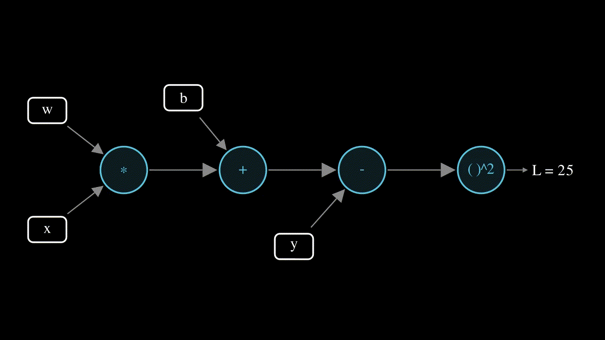
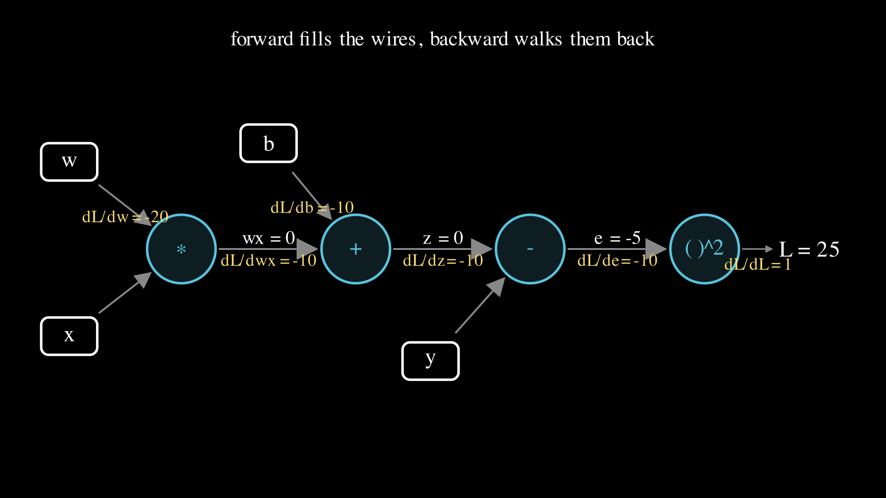
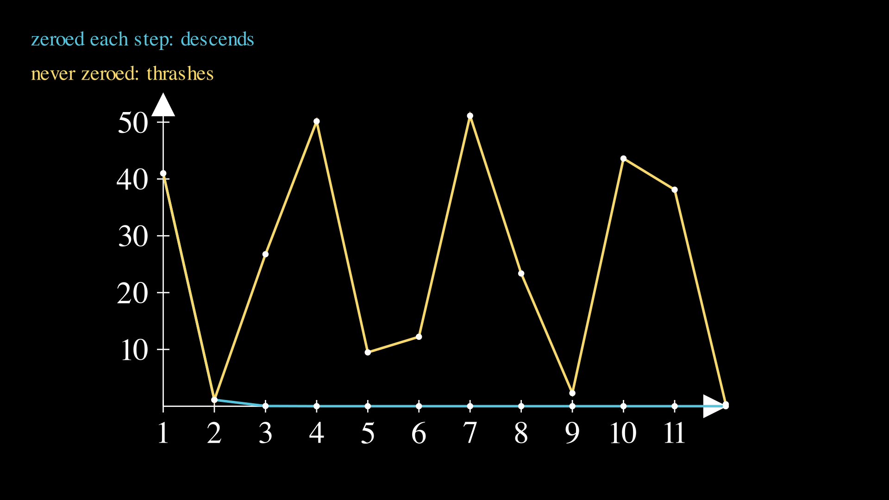

# Lesson 0004: autograd from scratch

Three lessons did the backward pass by hand, and every one used the same mechanical move: at each step of the computation, take the slope coming back from above, multiply by the step's own local slope, and add the result into the input. This lesson builds the machine that does that move for you, from nothing, in about forty lines of Python. The machine is a small class called `Value`, a number that remembers how it was made, and once it exists the backward pass stops being arithmetic you do and becomes arithmetic the graph does. The test it has to pass is strict: it must reproduce lessons 0001 and 0002 to the digit, with no hand-derived gradient anywhere.

Here is the whole idea in one animation, the backward walk through the graph of a single data point: the slope is seeded at the loss as 1, then flows back through each box, picking up one local factor at a time until it reaches the knobs.



There is a reveal at the end of this lesson, so it is only fair to state it at the start. The Go side of this repo has had an autograd engine since lesson 0001. The `grad` package that `cmd/soroban` has been calling to print the Go tables is exactly this `Value` class written in Go, and every Go table you have diffed against numpy was already produced by the machine you are about to build. This lesson does not introduce the engine. It uncovers it.

## A loss is a recipe, and a recipe is a graph

Take the smallest loss in the repo, one data point from lesson 0001: `x = 2`, `y = 5`, with the knobs at `w = 0` and `b = 0`. Its loss is built in four steps, each one operation on the results before it:

```
step 1:  wx = w * x     = 0 * 2   = 0
step 2:  z  = wx + b     = 0 + 0   = 0        (this is y_hat)
step 3:  e  = z - y      = 0 - 5   = -5
step 4:  L  = e * e      = -5 * -5 = 25
```

Draw those four steps as boxes wired together and you get a [computation graph](../../maths/computation-graph.md): the leaves on the left are the inputs, every other box is an operation, and reading left to right filling in numbers is the forward pass.



Nothing here is new. It is lesson 0001's loss for one point, drawn instead of written. What the drawing buys is a clear view of the backward pass, which is nothing more than the same picture walked in reverse.

## Every box knows one local slope

Backprop asks one question at each box: if this box's input moves by a hair, how much does its output move? That number is the box's local slope, and each kind of box has a rule for it that the earlier lessons already established by nudging.

| Box | Output | Local slope back to each input |
|-----|--------|-------------------------------|
| multiply | `a * b` | to `a` it is `b`, to `b` it is `a` |
| add | `a + b` | 1 to each |
| subtract | `a - b` | 1 to `a`, minus 1 to `b` |
| square | `a * a` | `2a` |
| relu | `max(0, a)` | 1 if `a > 0`, else 0 |

The multiply box is the only one whose slope needs a value from the forward pass, the other factor, which is the mechanical reason the engine has every box remember the inputs it was built from.

## The backward walk

To get the slope of `L` with respect to every leaf, walk the graph from `L` back toward the leaves, applying the [chain rule](../../maths/chain-rule.md) at each box: the slope of `L` with respect to a box's input is the box's local slope times the slope of `L` with respect to its output, the number arriving from above. Seed the walk with the slope of `L` with respect to itself, which is 1, and hand it back one box at a time.

```
seed        dL/dL  = 1
square      dL/de  = (local 2e = -10) * (from above 1)   = -10
subtract    dL/dz  = (local 1)        * (dL/de = -10)     = -10
add         dL/db  = (local 1)        * (dL/dz = -10)     = -10
            dL/dwx = (local 1)        * (dL/dz = -10)     = -10
multiply    dL/dw  = (local x = 2)    * (dL/dwx = -10)    = -20
            dL/dx  = (local w = 0)    * (dL/dwx = -10)    = 0
```

Read the two answers that matter: `dL/dw = -20` and `dL/db = -10`. Those are the numbers lesson 0001's one-point chain rule got by writing `2 * e * x = 2 * (-5) * 2 = -20` in a single line. The walk is that line unrolled: each box contributes one factor, and the boxes that looked invisible in the shortcut (the add's silent times 1, the subtract's) are steps in the walk. The shortcut was the backward pass all along, done in your head; the engine does it on the graph.

## The engine

Here is the whole thing. A `Value` wraps a float, carries a running `.grad`, remembers the nodes it came from, and holds a closure that pushes gradient to those nodes. Each operation builds a new `Value` and wires its backward closure with the local slope from the table above. This is the complete `micrograd.py`, minus the exp and log the exit test adds:

```python
class Value:
    def __init__(self, data, prev=()):
        self.data = float(data)
        self.grad = 0.0
        self._prev = tuple(prev)
        self._back = lambda: None

    def __add__(self, other):
        other = other if isinstance(other, Value) else Value(other)
        out = Value(self.data + other.data, (self, other))
        def back():
            self.grad += out.grad
            other.grad += out.grad
        out._back = back
        return out

    def __mul__(self, other):
        other = other if isinstance(other, Value) else Value(other)
        out = Value(self.data * other.data, (self, other))
        def back():
            self.grad += other.data * out.grad
            other.grad += self.data * out.grad
        out._back = back
        return out

    def sq(self):
        out = Value(self.data * self.data, (self,))
        def back():
            self.grad += 2 * self.data * out.grad
        out._back = back
        return out

    def backward(self):
        topo, visited = [], set()
        def build(n):
            if id(n) in visited:
                return
            visited.add(id(n))
            for p in n._prev:
                build(p)
            topo.append(n)
        build(self)
        self.grad = 1.0
        for n in reversed(topo):
            n._back()
```

The `backward` method does two jobs. First it topologically sorts the graph, which is a fancy name for a simple guarantee: order the nodes so that every node comes after all the nodes that fed it, so that when the walk reaches a node, the slope arriving from above is already complete. Then it seeds the output's grad to 1 and calls each node's closure in reverse of that order. Subtract, relu, and the rest follow the same shape as add and multiply; the full file is in `micrograd.py`.

## The one rule a hand pass never had to state

Every closure above uses `+=`, not `=`, and that is not a style choice. When a single value feeds more than one box, each box sends a slope back to it, and the value's true slope is the sum of them all. The smallest case that makes the rule visible is a value used twice in one expression:

```
y = x + x        at x = 3
```

By algebra `y = 2x`, so the slope is 2. In the graph, `x` feeds the add box on both wires, the add box returns slope 1 along each, and `x` collects `1 + 1 = 2`. An engine that overwrote the slope instead of adding would report 1 and be silently wrong. The same rule is why `w`, which feeds a multiply for every one of the four data points, correctly collects the sum of four slopes, and it is why training has to reset the gradients to 0 between steps, which is where this lesson's deliberate failure lives.

## Reproducing 0001 and 0002

The engine's whole job is to make the old numbers come out without a gradient formula in sight. Where lesson 0001 wrote `dw = 2 * (e * x).mean()` by hand, this lesson builds the loss out of `Value` nodes and calls `backward`:

```python
def loss_0001(w, b, xs, ys):
    return mean([((w * xi + b) - yi).sq() for xi, yi in zip(xs, ys)])

w, b = Value(0.0), Value(0.0)
L = loss_0001(w, b, xs, ys)
L.backward()
assert L.data == 41.0 and w.grad == -35.0 and b.grad == -12.0
```

Run the loop for 200 steps, rebuilding the graph each step from fresh `w` and `b` leaves, and it lands on numpy's exact final line, `w 2.004774, b 0.985965`. Feed the same engine lesson 0002's two-relu hidden layer, no new operation beyond the `relu` it already has, and its seven step-1 gradients come out `(-0.75, -0.5, 0.75, -0.5, -0.5, -0.5, -1.0)` at loss `0.25`, and its 300-step run reproduces numpy's final knobs byte for byte. One small engine, two different models, both old lessons recovered. `go run ./cmd/soroban 0004` prints the same table from the Go twin, and CI diffs the two languages line for line.

## Closing lesson 0001's loop

Lesson 0001 opened by measuring a slope with an experiment: nudge a knob by a hair, recompute the loss, divide the change. That number can now be checked against the engine that does the chain rule symbolically. With a nudge of `1e-6`, the finite difference of the loss comes out `-35.0000` for `w` and `-12.0000` for `b`, matching the engine to four decimals. The tiny remaining gap is the nudge not being infinitely small, the same reason lesson 0001's `-34.9925` was not quite `-35`. The engine has no such gap; it is the exact slope, because it is the exact chain rule.

## Break it on purpose: forget to zero the gradients

The graph is correct and the closures are correct, and the training loop can still be wrong in one classic way: reusing the leaf `Value` objects across steps without resetting their `.grad` to 0. Because every closure accumulates, the slopes from step 1 are still sitting in the leaves when step 2 runs, and step 2 piles its own slopes on top. Step 2's `dw` then reads `-40.75`, which is the stale `-35` from step 1 plus the correct `-5.75` for step 2, and the descent falls apart.



The blue line is the correct run, gradients zeroed each step, dropping to near zero and staying. The yellow line never zeros, and instead of descending it lurches: `41, 1.13, 26.76, 50.15, 9.48`, up and down while the code looks perfectly reasonable. That is the signature to file away, a loss that thrashes while nothing looks broken, and the cure is one line at the top of each step. Every framework has a `zero_grad` for exactly this, and now you know what it prevents. The tinier version of the same bug lives inside a single backward pass, writing `grad = ...` instead of `grad += ...`, and the test that catches it is the `x + x` from two sections ago: the accumulating version reads 2, the overwriting version reads 1.

## Exercises

1. Build `a + a` and confirm its slope is 2 at any value. Draw the graph: how many arrows leave the leaf, and which rule turns two 1s into a 2?
2. Predict the slope of `L = (x * x) * x` at `x = 2` before running it. This is `x^3`, and the engine reaches its answer by accumulating the slopes from `x`'s three uses. An answer of 4 or 8 means a missing accumulation somewhere.
3. Change the multiply closure's `+=` to a plain `=` and find the first lesson that breaks. Why does 0001's four-point loss still pass while `x * x` fails? (Hint: in 0001 no single multiply node has its input used on both wires.)

Answers are worked in `train.py`, which asserts every one.

## Exit test

Add `exp` and `log` to the engine (`exp`'s local slope is `exp` itself, `log`'s is `1/input`, both from the [exp and log page](../../maths/exp-log.md)), then reproduce a single point of lesson 0003. Build the [softmax](../../maths/softmax.md) and [cross-entropy](../../maths/cross-entropy.md) of three scores at zero init through `Value` nodes, call `backward`, and check the gradient of the loss with respect to each score. At zero init every probability is `1/3`, the loss is `ln 3 = 1.098612`, and with the true class being the middle one the three score gradients come out `(0.333333, -0.666667, 0.333333)`, which is exactly `p` minus the one-hot target, the friendly formula lesson 0003 derived by hand. The Go `grad` package already ships `Exp`, `Log`, and `Div` as the reference twin. Write the three Python methods yourself first, then check against `micrograd.py`.

Passing this is lesson 0003's exit test done a second way: the engine you built now differentiates softmax and cross-entropy with no hand gradient at all, which is the thing that makes the language models from lesson 0005 onward possible.

## Running it

**Locally.** `uv run lessons/0004-autograd/train.py`, or plain `python3 train.py` from the folder. It needs nothing but the standard library; there is no numpy in the engine or its asserts. Add `--torch` to cross-check the same graph against `torch.autograd`.

**On Google Colab.** Open [lesson.ipynb in Colab](https://colab.research.google.com/github/tamnd/soroban/blob/main/lessons/0004-autograd/lesson.ipynb), then Runtime, Run all. Nothing to install.

**The Go twin.** `go run ./cmd/soroban 0004` prints the same table from the `grad` package, and `go test ./grad/` runs the graph and accumulation tests.

## What is next

With an engine that differentiates any expression, the models stop being hand-differentiable toys. Lesson 0005 leaves regression behind for language: a bigram table counted over a tiny corpus, probabilities and sampling worked by hand, the first model in this repo whose output is text rather than a number.

The figures on this page were rendered by `visuals.py`; every number in them and in the prose was produced by running the code, not by hand.
