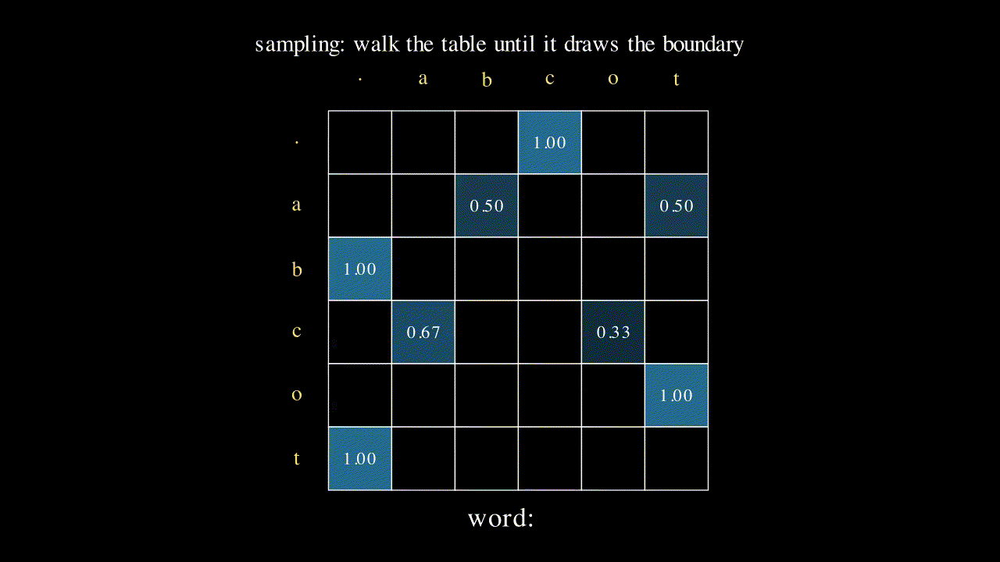
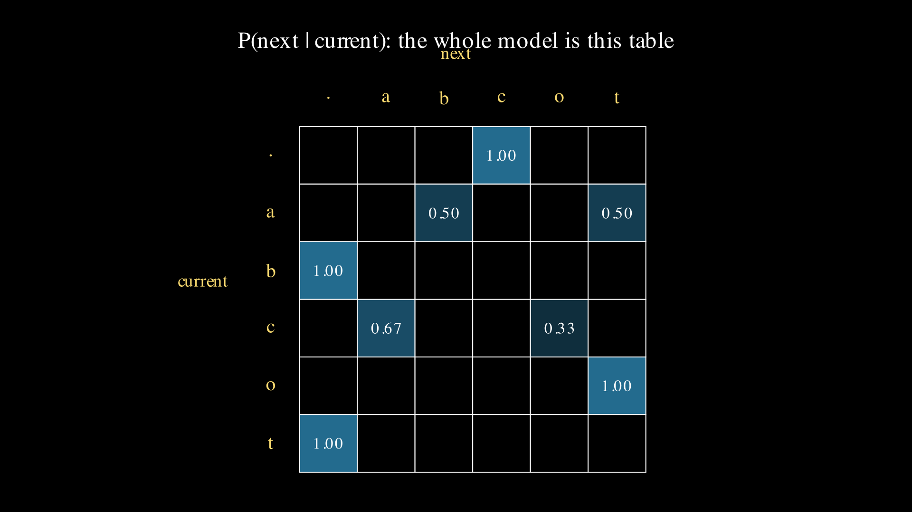

# Lesson 0005: language as counting

Four lessons fit numbers to numbers: a line, a curve, three temperature classes, and an engine that differentiates any of them. This one changes what the model is for. It reads a short list of words, counts which letter tends to follow which, and turns those counts into a machine that writes new words. There is no gradient descent here, no learning rate, no backward pass. The whole model is a table of tallies and one division, and yet the thing it produces is a working generative language model, the first model in this repo whose output is text instead of a number.



The claim to keep an eye on: this is the same object, in miniature, that the rest of the ladder scales up. Bigger corpus, longer context, and learned weights instead of raw counts, but the same three moves every time. Predict the next symbol as a probability distribution, score the prediction with the cross-entropy loss from lesson 0003, and sample to generate. Everything after this lesson is a way of making the prediction less crude; the loss and the sampling never change.

## The corpus, with boundaries

The training set is three words: cat, cot, cab. Small enough to count every bigram by hand, structured enough to have two real choice points. A language model needs to know where a word begins and ends, so wrap each word in a single [boundary token](../../maths/notation.md), written `.`, giving `.cat.`, `.cot.`, `.cab.`. The leading `.` is the state the model starts in before it has written anything; the trailing `.` is how it decides to stop. Without a boundary token a model can guess the next letter but can never end a word. The alphabet is every symbol that appears, six of them: `. a b c o t`.

## Count the pairs

A bigram is an adjacent pair of symbols. Slide a two-symbol window across each bounded word and tally every pair you see. Three words, four pairs each, twelve pairs total:

```
.cat.  ->  .c  ca  at  t.
.cot.  ->  .c  co  ot  t.
.cab.  ->  .c  ca  ab  b.
```

Tallied up: `.c` appears 3 times (every word starts with c), `ca` twice (cat, cab), and `co`, `at`, `ab`, `ot`, `b.` once each, with `t.` twice (both cat and cot end in t). That tally is the entire model. Everything from here is division.

## Normalize each row into probabilities

Group the pairs by their first letter, the current one, and divide each count by the group's total. That fraction is the model's probability for the next letter, and it is the [maximum likelihood estimate](../../maths/bigram.md): the probability that makes the training words as likely as possible turns out to be exactly the frequency you observed.

```
from . :  c=3         ->  c|. = 3/3 = 1.000
from c :  a=2, o=1     ->  a|c = 2/3 = 0.667,  o|c = 1/3 = 0.333
from a :  t=1, b=1     ->  t|a = 1/2 = 0.500,  b|a = 1/2 = 0.500
from o :  t=1         ->  t|o = 1.000
from t :  .=2         ->  .|t = 1.000
from b :  .=1         ->  .|b = 1.000
```

Each row sums to 1, so each is a valid probability distribution, the same shape a [softmax](../../maths/softmax.md) makes but reached by counting. Read the trained model out loud: a word starts with c; after c it is a two-to-one bet on a over o; after a it is a coin flip between t and b; o always goes to t; t and b always end the word. That sentence is the whole model, and counting wrote it.



The table is a lookup keyed by the current letter, one row of odds per letter. Hold that shape in mind. Lesson 0006 trains a single-layer network on these same three words, and the numbers its weights settle into, row by row, are this table.

## The loss is the lesson 0003 loss

How good is this model? The probability it assigns to a whole word is the product of its bigram probabilities along the word. For cat that is `P(c|.) * P(a|c) * P(t|a) * P(.|t) = 1 * 2/3 * 1/2 * 1 = 1/3`. The same computation gives cot and cab each a probability of 1/3 as well, so the model spreads its belief evenly across the three words it memorized, a clean sign the counting was symmetric.

The loss is the negative log of these probabilities, averaged over every bigram. Negative because a good model gives high probability and we want the loss to fall, and log because the probabilities of a whole corpus multiply and the log turns that product into a sum. Each word contributes `-log(1/3) = log 3`, and dividing by the twelve bigrams gives `log(3)/4 = 0.274653`. This is exactly the [cross-entropy](../../maths/cross-entropy.md) from lesson 0003, one term per position, with the true next letter as the one-hot target. The only thing that changed is where the probabilities came from: a tally instead of a softmax. The loss lesson 0003 built for ice, water, and steam is the loss every language model in this repo trains on.

## Sample: turn the table into a writer

A trained table can be run forward as a generator. Start in state `.`, look at that row, draw the next letter at random weighted by the row's probabilities, move to it, and repeat until the draw lands back on `.`. To make each draw checkable by hand, use inverse-transform sampling: line the letters up in a fixed order, take a roll between 0 and 1, and walk the running total of the row's probabilities until it first reaches the roll. Against the row for c, whose totals reach 0.667 at a and 1.0 at o, a roll of 0.2 lands in a's interval and a roll of 0.9 lands in o's.

Feed the model the rolls `0.5, 0.2, 0.8, 0.5` and watch it write:

```
state .   roll 0.5  ->  the . row is all on c, any roll picks c   ->  emit c
state c   roll 0.2  ->  0.2 falls in a's interval (0 to 0.667)      ->  emit a
state a   roll 0.8  ->  a's totals are .5 then 1.0, 0.8 picks t     ->  emit t
state t   roll 0.5  ->  the t row is all on ., picks .              ->  word ends
```

The word is cat. Rolls that steer o after c give cot, and rolls that steer b after a give cab. Fixing the rolls makes generation deterministic, which is how numpy, torch, and Go all sample the same words. Asked to write, the model writes its training set back, because with three words and this little data it has essentially memorized them, and memorization is what a probability of 1/3 per word means.

## Break it: a word the corpus never saw

Score the word dog. Its first bigram is `.d`, and d never started a word in the corpus, so its count is 0 and `P(d|.) = 0`. The product for the whole word is therefore 0, and its loss is `-log 0`, which is infinity. The model does not merely doubt dog, it calls it impossible, and a single impossible word makes the loss on any dataset containing it infinite. This is the zero-frequency problem, and it is not a bug in the arithmetic. It is what pure counting does with anything it has never seen, which on real text is most things.

The standard first fix is add-one smoothing: pretend every possible bigram was seen one extra time before you start counting. Then `P(d|.)` becomes `(0 + 1) / (3 + 6) = 1/9` instead of 0, where the 6 is the alphabet size, no probability is ever zero, and dog gets a small but finite loss. Its full smoothed probability works out to 0.000441 and its loss to 7.726654: a model that has never seen dog now finds it unlikely rather than impossible, which is the honest thing for it to say. The neural language models later in the ladder get this for free, because a softmax over real-valued scores can never output an exact zero.

## Exercises

1. Add the word `cab` to the corpus a second time, so it is cat, cot, cab, cab. Before running anything, predict the new `a|c` and `o|c`. Does the corpus loss go up or down, and why?
2. The model samples cat, cot, cab back with equal frequency. What single change to the corpus would make it sample cab twice as often as cat? (Hint: sampling frequency follows the probabilities, and the probabilities follow the counts.)
3. Score the word `at` (no leading c) by hand. Its first bigram is `.a`. Is that probability zero or not, and what does the answer tell you about which words this model considers possible?

Worked answers are in `train.py`, which asserts every one. The exit test in the next section is exercise 1 carried through to a number.

## Exit test

Run the corpus cat, cot, cab, cab and confirm the arithmetic. Now c has four outgoing edges, a a a o, so `a|c` rises to 3/4 and `o|c` falls to 1/4. The words are no longer equally likely: `P(cat) = 3/4 * 1/3 = 1/4`, `P(cot) = 1/4`, and `P(cab) = 3/4 * 2/3 = 1/2`. The corpus loss drops to 0.259930, below the 0.274653 it had before. The model got a lower loss by becoming more certain about c's next letter and betting more of its probability on cab, the word it now sees most. That is what training a language model always does: shift probability toward what the data actually contains. You just did it by adding one word to a tally instead of running a single gradient step, and lesson 0006 shows the gradient step lands in the same place.

## Running it

**Locally.** `uv run lessons/0005-bigram/train.py`, or plain `python3 train.py` from the folder. It needs only numpy. Add `--torch` to cross-check the count matrix and loss against a torch tensor version.

**On Google Colab.** Open [lesson.ipynb in Colab](https://colab.research.google.com/github/tamnd/soroban/blob/main/lessons/0005-bigram/lesson.ipynb), then Runtime, Run all. Nothing to install.

**The Go twin.** `go run ./cmd/soroban 0005` prints the same seven-line table from the `bigram` package, and `go test ./bigram/` runs the counting and sampling tests. The python and Go tables are diffed line for line in CI.

## What is next

The bigram table is a lookup keyed by the current letter, and looking a row up by index is exactly what an embedding does. Lesson 0006 replaces the counting with a single-layer network trained by the lesson 0004 engine, watches its weights converge to this same table, and then stacks the idea into a small network that looks at more than one previous letter. The road from counting to a neural language model starts here, and every step of it is graded against the numbers this lesson counted by hand.

The figures on this page were rendered by `visuals.py`; every number in them and in the prose was produced by running the code, not by hand.
