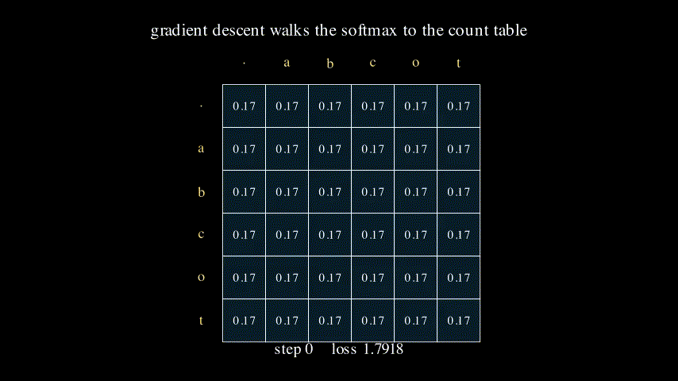
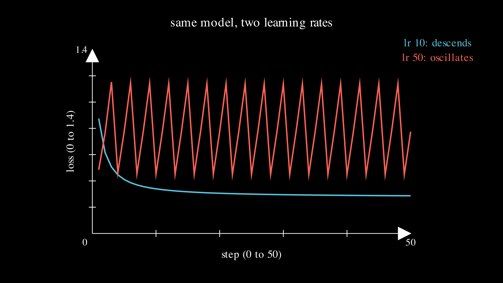

# Lesson 0006: embeddings, the neural bigram learns the table

Lesson 0005 built a language model by counting: tally the bigrams, divide, read off the probabilities. This lesson builds the same model without counting anything. It keeps a matrix of weights, scores each possible next letter, runs the scores through a softmax, and trains the weights by gradient descent with the engine from lesson 0004. No tallies. And yet the numbers it lands on are the tallies: the trained model reproduces the 0005 count table, digit for digit, because the gradient of the loss turns out to be the difference between what the model predicts and what the data shows, so descent has nowhere to go but the data.



This is the lesson where counting and learning shake hands. 0005 earned the table in one division; 0006 earns it in two hundred small steps, and they arrive at the same place. Watching that happen is worth more than either model alone, because everything above this lesson is the learning road, not the counting one, and this is the smallest example where you can check the two against each other by hand.

## The model is a weight matrix, read one row at a time

The alphabet is the same six symbols as 0005, `. a b c o t`, order fixed. The model is a 6 by 6 matrix `W`, thirty-six numbers. To predict the letter after the current letter, read that letter's row of `W`: six scores, called logits, one per possible next letter. That is the whole model, `logits = W[current]`, and reading a row of a matrix by index is exactly what an [embedding](../../maths/embedding.md) is. Written as a matrix product it is `onehot(current) @ W`, where the one-hot vector for the current letter has a single 1 that selects its row and zeroes the other five. Index lookup and matrix multiply are the same operation here; the index form is how you code it, the matrix form is how it slots into a network.

Turn the six logits into probabilities with the [softmax](../../maths/softmax.md) from lesson 0003, and score them with the [cross-entropy](../../maths/cross-entropy.md) loss from lesson 0003. Nothing about the loss or the sampling changed from 0005. The only thing that changed is where the probabilities come from: a softmax over learned scores instead of a division of counts.

## Start from zero: maximum ignorance

Set every weight to 0. Then every logit is 0, and the softmax of six zeros is six equal probabilities, 1/6 each. Whatever the current letter, the model thinks every next letter is equally likely, which is the most ignorant a model can be. The loss on any example is `-log(1/6) = log 6 = 1.791759`, and since every row is uniform, the whole corpus loss is log 6 too. That is the number gradient descent starts from and has to drive down.

## One step, and watch a weight move

Take all twelve bigrams at once, a full-batch gradient step, and follow the row for c, which three of the training examples look up: c is followed by a in cat, by o in cot, by a again in cab. From lesson 0003, one example contributes `p - y` to the logits of its row, the predicted distribution minus the one-hot of the true next letter. At the start `p` is uniform, so summing the three examples in row c gives

```
sum of (p - onehot) over c->a, c->o, c->a
  = 3 * (1/6 each)  -  (a counted twice, o once)
  = (0.5, 0.5, 0.5, 0.5, 0.5, 0.5)  -  (0, 2, 0, 0, 1, 0)     columns . a b c o t
```

Average over all twelve examples by dividing by 12, and the row-c gradient is `(0.5 - observed) / 12`: most negative at column a (`-0.125`), less negative at o (`-0.041667`), and slightly positive everywhere else. Read what that says. The gradient is predicted frequency minus observed frequency, and it is largest where the model most underweights what the data actually does. a followed c twice and the model gives it only its uniform share, so the gradient there is the steepest, and gradient descent, which subtracts the gradient, will raise `W[c, a]` the most.

Take the step at learning rate 10, `W = W - 10 * gradient`. The entry `W[c, a]` moves from 0 to 1.25, `W[c, o]` to 0.416667, and the four letters that never followed c go negative. After this single step the corpus loss has already fallen from 1.791759 to 0.874450, and the model already prefers a and o after c, in the two-to-one ratio the data has. The [gradient came out of the 0004 engine](../../maths/embedding.md), not off paper past this first check, which is the promise that lesson made: it differentiates a real language model for you.

## Where it converges

Keep stepping. The row-c gradient is zero only when the softmax of row c equals the observed frequencies, a at 2/3 and o at 1/3, which is the 0005 count-table row. So descent walks row c toward exactly `a|c = 2/3, o|c = 1/3`, and every other row toward its own 0005 frequencies, and the loss toward the minimum `log(3)/4 = 0.274653`. It approaches but never reaches the exact zeros in the table, because pushing a softmax output to a true zero needs a weight of minus infinity. After 200 steps the loss is 0.277674 and the c row reads `a|c = 0.665334, o|c = 0.331997`: the count table, learned. Sample the trained table with the same fixed dice lesson 0005 used and it writes cat, cot, cab straight back out, because its probabilities are within a thousandth of the counts.

## Two learning rates

The learning rate is the whole difference between converging and not. At 10 the loss slides down smoothly to 0.277674. At 50 it does not descend at all: it oscillates on a repeating sawtooth, 0.4846, 0.7636, 1.1527, and around again, still bouncing after fifty steps.



The reason is the deterministic rows. The letter after `.` is always c, after o always t, after t always the boundary, so those rows want ever-larger weights to drive their one probability toward 1. At learning rate 50 each step overshoots that moving target and the gradient flips sign, so the weights ping-pong instead of settling. This is the same learning-rate ladder lesson 0001 climbed, but the failure looks different: 0001 exploded to infinity, while here the cross-entropy gradient is bounded (every `p - y` sits between -1 and 1) so the worst it can do is oscillate. Same lesson, gentler cliff.

## The zero-frequency problem is gone

Lesson 0005 ended on a wound: the word dog scored a probability of exactly 0 and a loss of infinity, because one of its bigrams had a count of zero, and pure counting calls anything it never saw impossible. The neural model does not have this problem, and it is worth seeing why. Score an unseen in-alphabet bigram, c followed by t, which never happened in the corpus. The count model gives `P(t|c) = 0`. The trained neural model gives `P(t|c) = 0.000667`: small, but not zero. A softmax over finite scores can never output an exact zero, because `e` to any finite power is positive, so no bigram is ever impossible and no loss is ever infinite. The neural language model has 0005's add-one smoothing built into its shape, for free, as a side effect of using a softmax.

## Exercises

1. Before running anything, predict the sign of the gradient at `W[a, t]` on the very first step. a is followed by t once and by b once. Is the model under- or over-weighting t at the uniform start, and which way will the weight move?
2. The trained `a|c` is 0.665334, just short of 2/3. Would training for 2000 steps instead of 200 get it closer to 2/3, or is there a floor it cannot pass? (Think about what the exact 2/3 would require of the weights.)
3. Score the bigram o followed by t in the trained model. The count model gives `P(t|o) = 1`. Is the neural model's number exactly 1, above 1, or just below, and does your answer to exercise 2 explain it?

Worked answers are in `train.py`, which asserts every number this page states. The exit test is exercise 2 pushed to its conclusion.

## Exit test

Add an L2 penalty to the loss, which adds `reg * W` to the gradient, and retrain at learning rate 10 for 200 steps. Predict, before running, where `a|c` moves. The answer: the penalty pulls every weight toward zero, and the softmax of zeros is uniform, so it drags probability off the observed letters and back toward 1/6. At strength 0.10, `a|c` falls from 0.665334 to 0.340214, and the unseen `c->t` rises from 0.000667 to 0.113314. That is exactly what add-one smoothing did in 0005, now a continuous dial instead of a fixed plus-one: turn regularization up, smooth harder. Two models, the counting one and the neural one, and even their smoothing knobs turn out to be the same knob.

## Running it

**Locally.** `uv run lessons/0006-neural-bigram/train.py`, or plain `python3 train.py` from the folder. It needs only numpy. Add `--torch` to retrain the same model with `torch.optim.SGD` and confirm the loss and the rows agree.

**On Google Colab.** Open [lesson.ipynb in Colab](https://colab.research.google.com/github/tamnd/soroban/blob/main/lessons/0006-neural-bigram/lesson.ipynb), then Runtime, Run all. Nothing to install.

**The Go twin.** `go run ./cmd/soroban 0006` prints the same seven-line headline from the `neuralbigram` package, and `go test ./neuralbigram/` runs the init, one-step gradient, convergence, and sampling tests. The python and Go tables are diffed line for line in CI, so the two languages train the same model to the same digits.

## What is next

The neural bigram still looks at exactly one previous letter, the same blind spot the count model had, and no amount of training fixes a model that cannot see the context it needs. Lesson 0007 is attention, the mechanism that lets a model look back at more than one previous token and weight them by how much each one matters. The embedding row-lookup built here becomes the first layer of the tiny transformer that lesson trains, so the road from a count table to a transformer runs straight through this page, same loss and same sampling the whole way.

The figures on this page were rendered by `visuals.py`; every number in them and in the prose was produced by running the code, not by hand.
