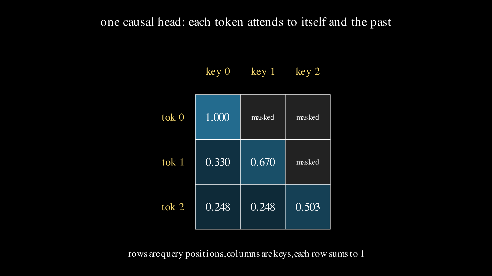
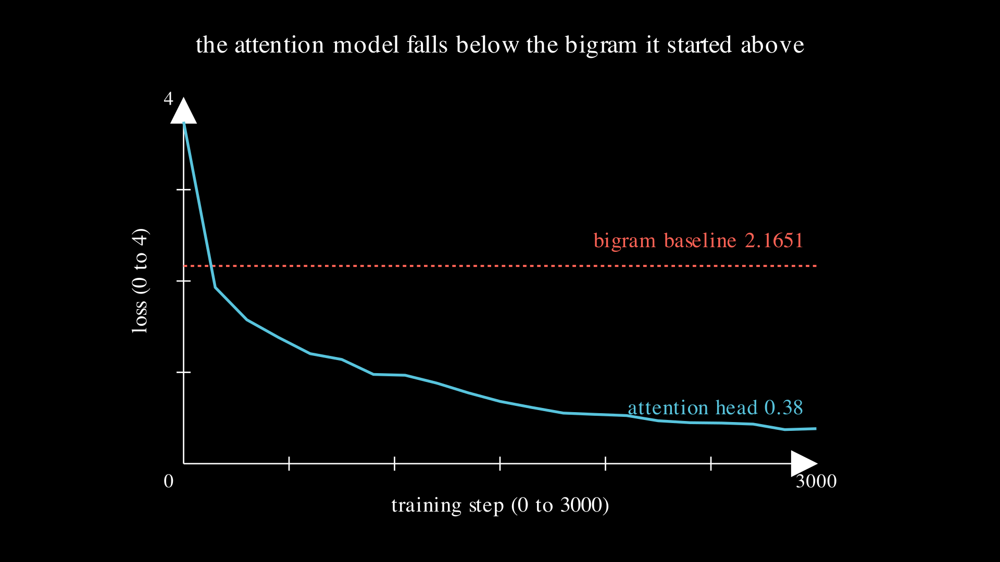

# Lesson 0007: attention, looking further back than one token

Every language model so far in this repo has had a one-token memory. The bigram of lesson 0005 counts what follows each letter, the neural bigram of lesson 0006 reads one row of a weight matrix, and both stop there: to predict the next letter they look at the current letter and nothing before it. That is a wall, not a training problem. If the right next letter depends on a letter two back, no bigram can represent the rule, however long you train it, because the earlier letter is not in what it is allowed to see. This lesson introduces the mechanism that removes the wall. Attention lets each position read every earlier position, decide from the data how much each one matters, and mix them accordingly. It is the piece that turns a lookup table into a transformer.



## Why one letter is not enough

Take two words, aba and cbc, and wrap each in the boundary token: `.aba.` and `.cbc.`. Look at what follows the letter b. In the first word b is followed by a, in the second by c. A bigram keyed on b sees b to a and b to c, one each, and can do no better than a coin flip. The information that settles the answer is the letter two back, a in one word and c in the other, and the bigram is forbidden from looking at it. Count the cost. The best possible bigram on this corpus pays the coin-flip price at every position, a loss of `log 2 = 0.693147` on average, and no training beats it. A model that could see two letters back would be uncertain only at the very first letter of each word, where the corpus genuinely is ambiguous, and would predict everything else with certainty, for an average loss of `log(2)/4 = 0.173287`. The gap between those two numbers is the value of the context a bigram throws away.

## Query, key, value

Attention gives every position three vectors, each a learned linear function of that position's [embedding](../../maths/embedding.md). The query is what this position is looking for. The key is what a position offers to anyone looking back at it. The value is the payload a position hands over when it is attended to. To predict from position i, form its query, compare it against the key of every earlier position, and use those comparisons to take a weighted average of the earlier values. The comparison is a dot product, large when the query and key point the same way, and the weights come from a [softmax](../../maths/softmax.md) over those dot products, so they are non-negative and sum to one. The full page on the mechanism, with the worked arithmetic, is [attention.md](../../maths/attention.md).

## The head on three tokens

To see it with no training and no randomness, run one head over three tokens whose embeddings are fixed by hand, `x0 = (1, 0)`, `x1 = (0, 1)`, `x2 = (1, 1)`, with the query, key, and value projections all set to the identity so that every remaining number is forced. The vector length is `d = 2`, so scores are divided by `sqrt(2) = 1.414214`, a scale of `0.707107`. Follow the third token. Its raw dot products with the three keys are `x2.x0 = 1`, `x2.x1 = 1`, `x2.x2 = 2`, which scale to `0.707107, 0.707107, 1.414214`. Softmax those and you get weights `0.248255, 0.248255, 0.503490`: the two equal matches split evenly, and the strongest match, the token with itself, takes about half. The output is the weighted sum of the values, `0.248255*(1,0) + 0.248255*(0,1) + 0.503490*(1,1) = (0.751745, 0.751745)`. Token 1 attends to positions 0 and 1 with weights `0.330238, 0.669762`, and token 0 attends only to itself. Those are the numbers in the heatmap above, and the code asserts every one against numpy and again against torch.

## The scale and the mask

Two details in that paragraph carry weight. The division by `sqrt(d)` is there because a dot product of two d-long vectors is a sum of d terms, so its size grows with d, and without the scale the scores at large d would push the softmax toward a one-hot spike where its gradient nearly vanishes and learning stalls. Dividing by `sqrt(d)` holds the scores steady no matter how wide the vectors get. The mask is what makes the head causal. A language model predicts token i+1 from the tokens up to i, so position i is allowed to attend only to positions at or before it. Everything to the right has its score set to minus infinity before the softmax, which sends its weight to exactly zero. That is why token 0 sees only itself and token 2 sees all three, and it is what lets a single forward pass train on every position of a sequence at once without any position reading its own answer.

## From a head to a transformer

One head reading three abstract tokens is the mechanism. To see it do something, wire it into the smallest model that still deserves the name transformer and train it on real text. An input character becomes a vector by an embedding lookup, a position embedding adds where-in-the-sequence information, one attention head lets each position read the earlier ones, a small two-layer network transforms each position on its own, and a final linear layer turns the result into a score for every possible next character, graded by the same [cross-entropy](../../maths/cross-entropy.md) loss as every model before it. Residual connections and layer normalization hold the training steady; they are plumbing, named here and not the subject. About sixty thousand weights, one head, the same loss and sampling loop as the bigram.

## Trained on a few thousand characters

The training text is a few thousand characters of TinyStories, a public dataset of very short children's stories with a small vocabulary, lowercased and reduced to letters, spaces, and a little punctuation: 19 stories, 9311 characters, an alphabet of 33. First, the baseline. A bigram counted on this exact text scores an average cross-entropy of 2.1651, the number the attention model has to beat. Then train the transformer for three thousand steps, about a minute on a laptop CPU. Its loss starts above the bigram, near 3.7, crosses below the baseline within the first two hundred steps, and settles around 0.38.



That final loss sits far under the bigram not because the model generalizes, on nine thousand characters with sixty thousand weights it mostly memorizes, but because it can use context the bigram cannot see. Sample from it, seeding on a newline and drawing one character at a time, and it writes text a bigram sampling single letters never could:

```
once upon a time, there was a wealthy man ... the dog named sam. sam ... there
many kids were so happy to be with all celebrate! said it lily
```

Not every phrase parses, but the words are real, the punctuation lands, and the story register is unmistakable, all from one attention head reading a few thousand characters. The memorization is the honest setup for the next lesson, which measures the gap between training loss and held-out loss and calls it by its name.

## Exercises

1. Before computing anything, predict which of the three tokens has the sharpest attention, the one that concentrates the most weight on a single position. Then read the heatmap to check.
2. Token 2's weights with the scale are `0.248255, 0.248255, 0.503490`. Predict whether removing the scale, dividing by 1 instead of `sqrt(2)`, makes the strongest weight larger or smaller, and why. This is the exit test.
3. The bigram floor on aba, cbc is `log 2` and the context floor is `log(2)/4`. Explain in one sentence why the ratio is exactly four, using the count of positions and how many of them are ambiguous.

Worked answers are in `train.py`, which asserts every number this page states.

## Exit test

Recompute token 2's attention weights with no scale: divide the raw dot products `1, 1, 2` by 1 instead of by `sqrt(2)`, and softmax. Predict the three weights before running. The answer: `0.211942, 0.211942, 0.576117`, sharper than the scaled `0.248255, 0.248255, 0.503490`, with more mass on the strongest match and less on the ties. That sharpening is exactly what the `1/sqrt(d)` scale exists to hold back, so that at large d the softmax does not collapse to one-hot and starve the gradient. The code asserts the unscaled weights.

## Running it

**Locally.** `uv run lessons/0007-attention/train.py` runs the by-hand head and the two floors, needs only numpy, and prints the seven-line headline. Add `--torch --train` to cross-check the head in torch and train the tiny transformer on TinyStories, which needs torch and takes about a minute.

**On Google Colab.** Open [lesson.ipynb in Colab](https://colab.research.google.com/github/tamnd/soroban/blob/main/lessons/0007-attention/lesson.ipynb), then Runtime, Run all. The notebook inlines the model, so nothing needs installing beyond the torch cell.

**The Go twin.** `go run ./cmd/soroban 0007` prints the same seven-line headline from the `attention` package, and `go test ./attention/` runs the head-weight, head-output, and floor tests. The python and Go headlines are diffed line for line in CI, so the two languages compute the same head and the same floors to the same digits.

## What is next

One head reads the past; real transformers stack many heads and many blocks, but the arithmetic per head is exactly what is on this page. Lesson 0008 stops adding architecture and turns to the training loop itself as an instrument: how overfitting shows up as a gap between training loss and held-out loss, how the number of weights trades against the number of examples, and how the learning rate is scheduled, using this same tiny transformer as the thing being measured. The road from a count table to a transformer is now complete in miniature; what remains is learning to drive it.

The figures on this page were rendered by `visuals.py`; every number in them and in the prose was produced by running the code, not by hand.
