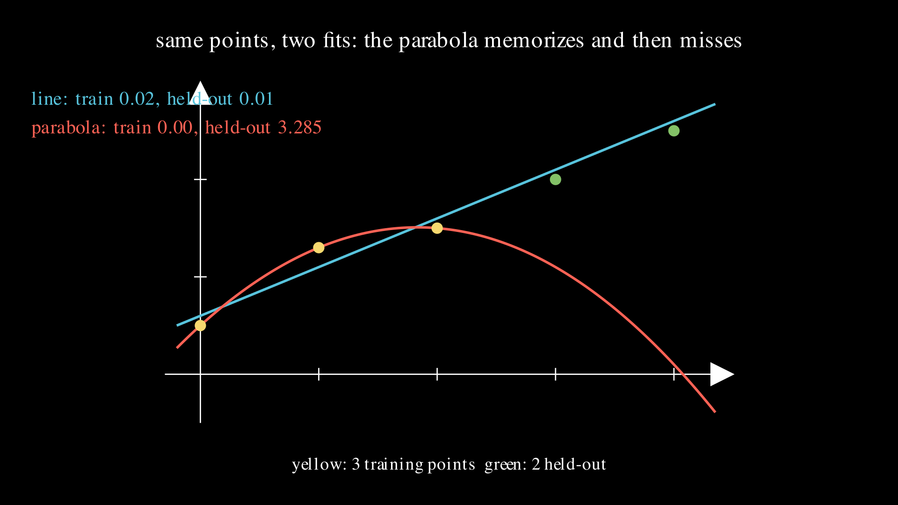
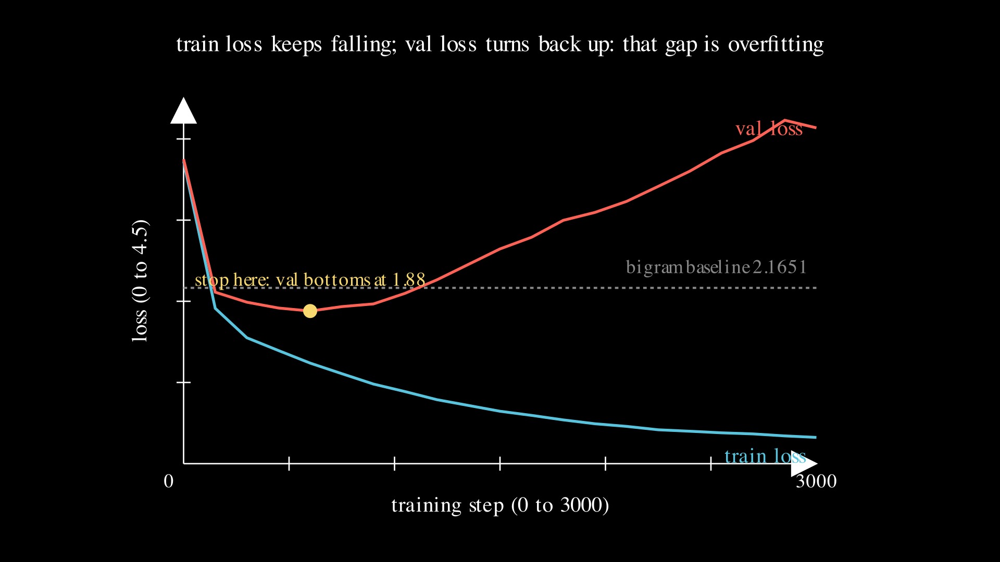

# Lesson 0008: the training loop as instrument

Every lesson in this repo so far has judged its work by one number, the training loss, and celebrated when it fell. Lesson 0001 watched a line's error drop across three steps. Lesson 0007 watched a transformer's loss fall from 3.7 to 0.38 and called it a win. This lesson is where that habit gets audited. A model with more parameters than data points can drive its training loss to zero by memorizing the training set outright, and a memorized answer key says nothing about a question the model has not seen. The training loss, on its own, cannot tell learning from memorizing. To tell them apart you need a second number: the loss on data the model never trained on. The gap between the two is the whole subject of this lesson, and it has a name, overfitting.



## Two fits to the same points

Start with the smallest example that shows it, no neural network required. The true relationship is a straight line, `y = 0.5x + 0.5`. Sample it at `x = 0, 1, 2`, but nudge the middle sample off the line, from its true `1.0` up to `1.3`. That nudge is noise, the small corruption every real measurement carries. So the three training points are `(0, 0.5)`, `(1, 1.3)`, `(2, 1.5)`. Hold out two clean points that sit exactly on the true line, at `x = 3` and `x = 4`, so `y = 2.0` and `2.5`, and never fit on them. Now fit two models of different capacity and read both on the held-out points.

A straight line has two parameters. Fit by least squares, it comes out to `y = 0.5x + 0.6`. It cannot pass through all three training points, because they are not collinear, so it keeps a small training error of 0.020. A parabola has three parameters, one for each training point, and three parameters can bend a curve through any three points exactly. The interpolating parabola is `y = -0.3x^2 + 1.1x + 0.5`, and its training error is exactly zero: at `x = 1` it returns `-0.3 + 1.1 + 0.5 = 1.3`, the noisy point, hit dead on. On the training set the parabola wins, 0.000 against 0.020, and it is not close.

Then read the held-out points, and the verdict flips. The line predicts `2.1, 2.6` against the true `2.0, 2.5`, for a held-out error of 0.010. The parabola bent downward to catch the noisy middle point, and that bend keeps going: at `x = 3` it predicts `1.1`, at `x = 4` it predicts `0.1`, against the true `2.0` and `2.5`. Its held-out error is 3.285, worse than the line by a factor of 328.

| model | parameters | train error | held-out error |
|-------|-----------:|------------:|---------------:|
| line | 2 | 0.020 | 0.010 |
| parabola | 3 | 0.000 | 3.285 |

If you picked your model by training error, as every earlier lesson implicitly did, you would pick the parabola, the worse model, every time. The parabola did not learn the line; it memorized three points, noise and all. The held-out set is the instrument that catches the mistake. The full worked page is [overfitting.md](../../maths/overfitting.md).

## The threshold is parameters against data points

The reason the parabola could memorize is a counting fact. A polynomial with as many parameters as there are data points can pass exactly through all of them, whatever the data. Two parameters fix a line through two points; three fix a parabola through three. When the parameter count reaches the number of data points, training error stops being evidence and becomes a foregone conclusion. Below that line the model lacks the capacity to memorize and can only capture broad structure; above it, memorizing is not just possible but easy. That single ratio, parameters divided by data points, predicts how wide the gap will open, and it scales straight up from a parabola to a transformer.

Count lesson 0007's transformer the same way. Its token and position embeddings, four attention projections, feed-forward block, three layer norms, and output head add up to 58273 parameters. It trained on 9311 characters. That is 6.259 parameters per character, six times past the memorization threshold. The reason its training loss fell to 0.38 was not that it understood English; it is that a model that far over the threshold can memorize a few thousand characters without trying. Lesson 0007 admitted this in passing. This lesson measures it.

## The same instrument on the transformer

Turn the validation instrument on that transformer. Split the TinyStories text into the first 90 percent for training, 8379 characters, and the last 10 percent held out, 932 characters the model never trains on. Then train three versions of the same architecture at increasing width, `D = 16, 32, 64`, for three thousand steps each, and every 150 steps measure the loss on both splits.



The picture is the parabola story at scale. Training loss keeps falling for all three widths, and the wider the model the lower it drives that number. Held-out loss does the opposite. It falls at first, because early on the model is learning real structure that helps on any text, then bottoms out and climbs, because past that point the model is fitting quirks specific to the training characters that do not transfer. The wider the model, the lower its training loss and the higher its final held-out loss: the gap is overfitting, and more capacity buys more of it.

```
  D=16   5377 params  0.64/char  final train 1.286  final val 2.096  best val 1.978 @ step 1500
  D=32  16865 params  2.01/char  final train 0.932  final val 2.323  best val 1.964 @ step 1050
  D=64  58273 params  6.95/char  final train 0.323  final val 4.136  best val 1.880 @ step 600
```

Read the rows. The narrow `D = 16` model sits below one parameter per character, cannot fully memorize, and keeps its two losses within about 0.8 of each other. The wide `D = 64` model, at seven parameters per character, drives training loss down to 0.323 and pays for it with a held-out loss of 4.136, a gap of 3.8. Notice also where each held-out curve bottoms: step 1500 for the narrow model, step 600 for the wide one. More capacity overfits sooner. The bottom of that curve is the moment the model knew the most that transfers, and stopping there, early stopping, is the simplest defense there is. For the wide model that moment is step 600, held-out loss 1.880, long before the run ended.

## Below the baseline, then above it

The bigram from lesson 0007, counted on this text, scored 2.1651 on average, and that number is drawn as the dashed line. Follow the wide model's held-out curve against it. Early, at its step-600 minimum, held-out loss is 1.880, comfortably below the bigram: the transformer, stopped at the right moment, genuinely beats a count table on text it has never seen. Trained to the end, held-out loss is 4.136, far above the bigram: the same model, run too long, is now worse than the dumb baseline it started ahead of. One model, two verdicts, and only the validation curve tells you which one you are getting. The training loss, which fell smoothly to 0.323 the whole way, would have told you the run kept getting better right up to the point where it was twice as bad as a bigram.

## Three levers, and one that barely moves

The gap has three honest levers. Fewer parameters shrinks it: the `D = 16` model overfits far less than `D = 64`. More data shrinks it: the same model against more characters pushes the ratio back below the threshold. Stopping earlier sidesteps it: take the model from the bottom of the U and throw away the rest of the run. It is worth naming a lever that does not help much here, because tutorials oversell it. The learning-rate schedule, decaying the step size over training instead of holding it fixed, is a real tool, but on a model overfitting this hard it barely moves the held-out minimum, 1.889 with a cosine decay against 1.880 without. When the problem is too much capacity for too little data, the schedule is not the fix; capacity, data, and early stopping are.

## Exercises

1. Before reading the table, predict which of the three widths will have the lowest training loss at step 3000, and which will have the lowest held-out loss. They are not the same model. Then check.
2. The parabola's held-out error is 3.285. Recompute it by hand: evaluate `y = -0.3x^2 + 1.1x + 0.5` at `x = 3` and `x = 4`, subtract the true `2.0` and `2.5`, square, and average. Confirm you get 3.285.
3. The `D = 16` model's held-out loss bottoms at step 1500 and `D = 64`'s at step 600. Explain in one sentence why more capacity makes the minimum arrive sooner.

Worked answers are in `train.py`, which asserts every number this page states.

## Exit test

The wide model's held-out loss at its step-600 minimum is 1.880, below the bigram's 2.1651. Its held-out loss at step 3000 is 4.136, above the bigram. Predict, before running, what the held-out loss of a hypothetical model that memorized the training set perfectly, training loss exactly zero, would be on the held-out split: lower than the bigram, roughly equal to it, or higher. The answer is higher, and by a lot. A model that has driven training loss to zero has spent all its capacity reproducing the training characters and has learned nothing that transfers, so on unseen text it is worse than a model that at least counted honest frequencies. Perfect training loss is the strongest possible warning sign, not the goal. The code trains to a 0.323 training loss and a 4.136 held-out loss, and asserts the second is above the bigram baseline while the early-stopped minimum is below it.

## Running it

**Locally.** `uv run lessons/0008-training-loop/train.py` runs the by-hand line-and-parabola core, needs only numpy, and prints the six-line headline. Add `--train` to split the TinyStories text, train the three widths, and print the capacity sweep and the gap, which needs torch and takes about a minute.

**On Google Colab.** Open [lesson.ipynb in Colab](https://colab.research.google.com/github/tamnd/soroban/blob/main/lessons/0008-training-loop/lesson.ipynb), then Runtime, Run all. The notebook inlines the model and the text, so nothing needs installing beyond the torch cell.

**The Go twin.** `go run ./cmd/soroban 0008` prints the same six-line headline from the `overfit` package, and `go test ./overfit/` runs the line, parabola, and parameter-count tests. The python and Go headlines are diffed line for line in CI, so the two languages compute the same fits and the same count to the same digits.

## What is next

The training loop is now an instrument you can read: training loss for progress, held-out loss for honesty, and the gap between them for overfitting. Lesson 0009 turns to a different measurement, the cost of the loop itself. Every step of every run in this repo has spent a definite number of floating-point operations, and there is a clean rule, roughly six operations per parameter per token, that predicts it. The next lesson computes that ledger by hand for a GPT-2-sized model, then measures a real GPU against it to see how close the paper number lands. From what a model learns, to what it costs to make it learn.

The figures on this page were rendered by `visuals.py`; every number in them and in the prose was produced by running the code, not by hand.
