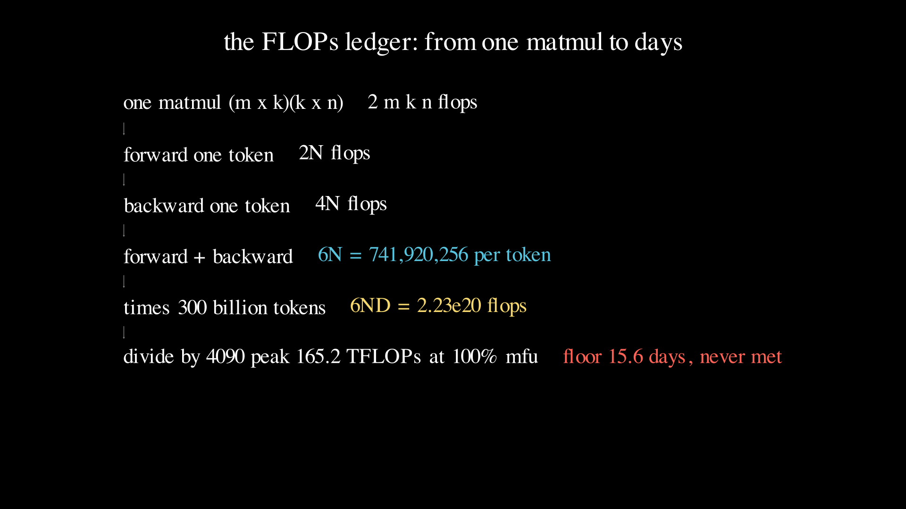
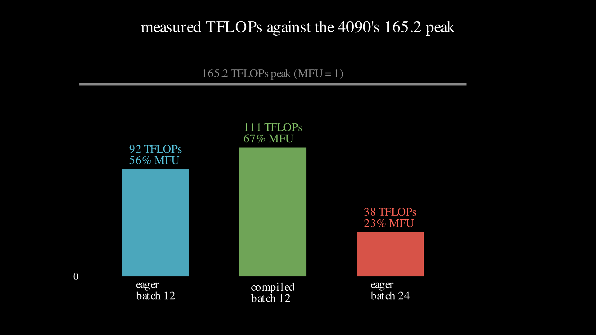

# Lesson 0009: the FLOPs ledger

Every lesson so far asked whether a model learns. This one asks what learning costs, in the only currency a GPU spends: floating-point operations, multiplies and adds on decimal numbers. The surprising thing is how few numbers you need. The cost of a training run is one multiplication away from known: a run over `D` tokens of a model with `N` parameters costs about `6ND` operations. That single formula budgets a run before it starts, and it comes straight out of counting the multiplies in a matrix product. The by-hand half of this lesson derives `6ND` from one matrix multiply and puts GPT-2-124M on the ledger to the exact operation. The experiment half runs that same model on an RTX 4090, times it with a stopwatch, and reconciles the measured throughput with the paper number through a single ratio.



## What one matrix multiply costs

A forward pass is matrix multiplies, so start with the cost of one. Multiply an `m x k` matrix by a `k x n` matrix and each of the `m*n` output entries is a dot product of one row against one column, both of length `k`: that is `k` multiplies and `k-1` adds, about `2k` operations. There are `m*n` entries, so the whole multiply costs `2*m*k*n` operations. A 2-by-3 matrix times a 3-by-2 one is `2*2*3*2 = 24` operations, and every parameterized layer in a transformer, the projections and the feed-forward, is a multiply of exactly this shape. The whole FLOP count is this one formula applied over and over, so the arithmetic never gets harder than multiplying three numbers. The full page is [flops.md](../../maths/flops.md).

## From one multiply to 6N per token

A parameter is a number the model multiplies its input by inside one of those matrix multiplies, and each parameter is used once per token as a multiply followed by an add, two operations. So a forward pass costs about `2N` operations per token for a model with `N` parameters. The backward pass, which computes the gradients, does two matrix multiplies the size of the forward one for each weight matrix: one sends the gradient back to the layer's input, one produces the gradient for the optimizer. That is twice the forward cost, `4N` per token. Add them and one token costs `2N + 4N = 6N` operations forward and backward. Multiply by the number of tokens `D` and the whole run costs `6ND`. Two numbers and a multiply by six.

## GPT-2-124M on the ledger

Now put a real model on it. GPT-2-124M has vocabulary 50257, width 768, 12 layers, context 1024, and 12 attention heads. Count its parameters block by block with the matmul-weight shapes from lesson 0007: a token embedding of `50257*768 = 38597376`, a position embedding of `1024*768 = 786432`, twelve transformer blocks of 7087872 each, and a final layernorm, with the output head sharing weights with the token embedding so it adds nothing. The total is 124439808, the 124M in its name. The `N` that goes in `6ND` drops the position table, which is looked up rather than multiplied through, leaving 123653376 non-embedding parameters. At `6N` that is 741920256 operations per token.

The `6N` rule leaves one thing out: the attention scores, where each token compares itself against every earlier token. That work grows with context length, not with parameters, and across the model it adds `12*L*H*(D/H)*T = 113246208` operations per token, about 15 percent on top of `6N`. So `6ND` is a floor, not the exact bill, and it gets looser as the context grows. For a full run at nanoGPT's reproduction scale of 300 billion tokens the budget is `6 * 123653376 * 3e11 = 2.23e20` operations, 223 exaFLOPs to train one GPT-2-124M from scratch.

## A floor on wall-clock time

An RTX 4090 advertises 165.2 teraFLOPs of bfloat16 tensor-core throughput, `1.652e14` operations per second. Divide the budget by the peak and the run would take `2.23e20 / 1.652e14 / 86400 = 15.6` days. That is a floor no run meets, because it assumes the card runs at its full advertised rate every second, which never happens. The fraction of the advertised rate a run actually sustains has a name, model FLOPs utilization, MFU, and the true time is the floor divided by the MFU. The whole point of the experiment is to measure that fraction on a real 4090 and see how far above 15.6 days the honest number lands.

## What the 4090 did

Build GPT-2-124M in PyTorch, the lesson 0007 architecture scaled up, and confirm it reports 124439808 parameters before timing anything. Run eight warmup steps, then time thirty steps of forward-plus-backward with the GPU synchronized around the timed region, and turn the wall-clock into tokens per second, achieved teraFLOPs, and MFU against the 165.2 peak.



```
device NVIDIA GeForce RTX 4090
config                ms/iter   tok/sec   TFLOPs     MFU  mem GB
eager, batch 12         114.1   107,735     92.1   55.8%    12.1
compiled, batch 12       94.8   129,601    110.8   67.1%     7.7
eager, batch 24         553.1    44,431     38.0   23.0%    22.4
```

Plain eager PyTorch sustains 92.1 of the card's 165.2 advertised teraFLOPs, an MFU of 55.8 percent, with no tuning at all, because flash attention and the tensor cores are already doing most of the work. A first guess of 30 to 40 percent, the prediction this lesson wrote down before running, was too low: real hardware on a modern kernel does better than intuition expects. Adding `torch.compile`, which fuses kernels into fewer, larger GPU launches, lifts MFU to 67.1 percent and cuts memory as a bonus, because fused kernels keep fewer intermediates alive. Two-thirds of a 4090's paper peak, from one line of code on top of eager PyTorch.

## The memory cliff

The batch-24 row is the deliberate failure. The natural guess is that a bigger batch runs faster, since it is more parallel work. It runs more than twice as slow. At batch 24 the model needs 22.4 GB on a 24 GB card, and near that ceiling the allocator stops finding free blocks cheaply and the run spends its time managing memory instead of multiplying. Throughput falls from 107,735 to 44,431 tokens per second and MFU from 55.8 to 23.0 percent: the same code, a bigger batch, and far less useful work. The failure signature is a throughput cliff at a memory boundary, and it is the last quiet reading before a run crashes outright with an out-of-memory error. When a run mysteriously slows down after someone raised the batch size, this is the first thing to check.

## Reconciling the stopwatch with the ledger

Put the measurement back against the paper. At the eager rate of 107,735 tokens per second, 300 billion tokens take `300e9 / 107735 / 86400 = 32.2` days on one 4090, against the 15.6-day floor. The two numbers reconcile exactly through the two things the floor left out. The floor assumed 100 percent MFU; the real run is at 55.8 percent, which alone stretches 15.6 days to `15.6 / 0.558 = 28.0`. The floor also counted only `6N` per token; the real work includes the attention term, 15.3 percent more, stretching it further to `28.0 * 1.153 = 32.2` days. The ledger and the stopwatch agree to the day once MFU and the attention term are both put in, which is why the paper number is worth computing: it tells you what the run should cost, and a measurement that disagrees means something is wrong with the run, not with the arithmetic.

## Exercises

1. GPT-2-medium is vocabulary 50257, width 1024, 24 layers, context 1024, 16 heads. Compute its total parameters, its non-embedding `N`, and its `6N` per token by hand, then check against 354823168, 353774592, and 2122647552. This is the exit test.
2. At the compiled rate of 129,601 tokens per second, how many days is 300 billion tokens? Predict whether it beats the eager 32.2 days before you divide.
3. The attention term is `12*L*H*(D/H)*T` per token and grows with context `T`. Recompute it for context 2048 instead of 1024, as a fraction of `6N`. Explain in one sentence why `6ND` gets less accurate as context grows.
4. If you had eight 4090s at the same 55.8 percent MFU, how long is the 300-billion-token run, assuming perfect scaling? Name one thing perfect scaling ignores that a real cluster does not deliver.

Worked answers are in `train.py`, which asserts the parameter counts and the ledger numbers this page states.

## Exit test

Do GPT-2-medium by hand without looking back at the GPT-2-124M numbers. Same recipe: a token embedding `50257*1024`, a position embedding `1024*1024`, 24 blocks each with two layernorms, a query-key-value projection `1024*3072` plus bias, an output projection `1024*1024` plus bias, and a feed-forward of `1024*4096` up and `4096*1024` down each plus bias, a final layernorm, and a tied head. Sum it and you should get total 354823168, and dropping the position table leaves non-embedding 353774592, so `6N` per token is 2122647552. The lesson is passed when your hand numbers match those three, checked by `train.py`, not when the page has been read.

## Running it

**Locally.** `uv run lessons/0009-flops-ledger/train.py` asserts every number on this page and prints the six-line headline, and it needs nothing beyond a Python interpreter. Add `--bench` to build GPT-2-124M and run the benchmark, which needs a CUDA GPU; without one it prints a skip line and exits clean.

**On Google Colab.** Open [lesson.ipynb in Colab](https://colab.research.google.com/github/tamnd/soroban/blob/main/lessons/0009-flops-ledger/lesson.ipynb), then Runtime, Run all. A free T4 will not match a 4090's numbers, but it runs the same benchmark and shows the same shape: an MFU well under one, and the batch-size cliff when memory runs out.

**The Go twin.** `go run ./cmd/soroban 0009` prints the same six-line ledger from the `flops` package, and `go test ./flops/` checks the matmul cost, the GPT-2-124M and GPT-2-medium parameter counts, the per-token FLOPs, and the 15.6-day floor. The Python and Go headlines are diffed line for line in CI, so the two languages compute the same ledger to the same digits.

## What is next

The ledger is now something you can read off a config: parameter count times token count times six, divided by a GPU's peak and its MFU, gives days. Lesson 0010, the last before graduation, turns from training a model to adapting one. Fine-tuning a 124M or a 7B model by touching every parameter is expensive by exactly this ledger; LoRA changes the count, training a small pair of matrices that stands in for a full weight update, so that `r = 16` on a 4096-by-4096 matrix is under 1 percent of its parameters. The next lesson counts those parameters by hand and runs a first real QLoRA fine-tune from the main spec's lane.

The figures on this page were rendered by `visuals.py`; every number in them and in the prose was produced by running the code, not by hand.
