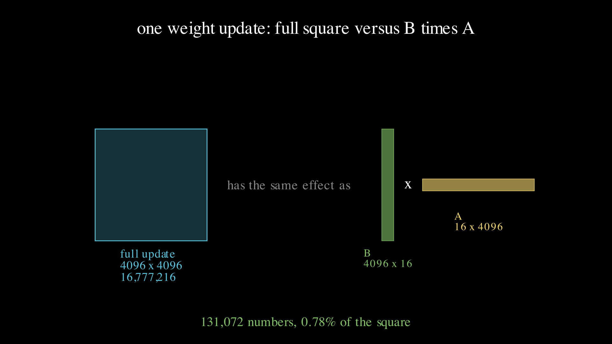
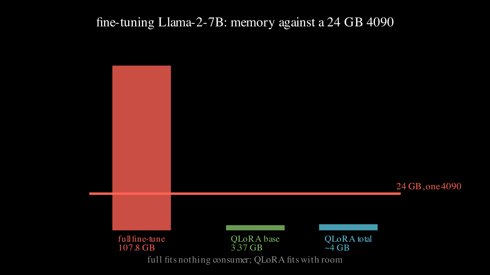

# Lesson 0010: fine-tuning arithmetic, LoRA and QLoRA

The ladder ends where most real work starts: taking a model someone else trained and bending it to a new task without paying to train it again. The surprise is that this is an arithmetic problem before it is a machine problem. A full update to a weight matrix is the whole matrix, and for a seven-billion-parameter model that update plus its optimizer state wants about a hundred gigabytes, more than four times what a single 24 GB card holds. LoRA replaces each full update with a low-rank stand-in of a few thousand numbers, and QLoRA freezes the base in four-bit precision on top, so the same fine-tune drops from a hundred gigabytes to about five and fits one 4090. The by-hand half of this lesson counts every one of those numbers exactly. The experiment half loads Llama-2-7B in four bits, attaches the adapters, confirms the trainable count is the hand number to the digit, and trains it on one card.



## One weight, full versus low-rank

Take one attention projection in Llama-2-7B, a square weight of shape 4096 by 4096. A full fine-tune learns an update the same shape, so it has `4096 * 4096 = 16777216` numbers, every one trained. LoRA does not learn that matrix directly. It writes the update as `B @ A`, where `B` is 4096 by 16 and `A` is 16 by 4096, and 16 is the rank `r`. The product of a 4096-by-16 and a 16-by-4096 matrix is 4096 by 4096, the right shape, but `B` and `A` together hold only `r * (d + k) = 16 * (4096 + 4096) = 131072` numbers. That is `131072 / 16777216 = 0.78` percent of the full update: the adapter is under one part in a hundred of the weight it stands beside. The full page is [lora.md](../../maths/lora.md).

## Why the adapter starts as a no-op

Attaching an untrained adapter must not change the model, or the pretrained weights are corrupted before any learning happens. LoRA guarantees this by setting `B` to all zeros and `A` to small random values. Then `B @ A` is a zero matrix times anything, which is zero, so the effective weight is the frozen base plus zero, the base unchanged. The first gradient flows into `A` and `B`, `B` leaves zero, and the adapter starts to bend the output. This is why LoRA can be bolted onto any pretrained model with no warm-up: on the forward pass at step zero it is the identity, and only training moves it.

## Llama-2-7B on the ledger

Now put a real model on it. Llama-2-7B has vocabulary 32000, hidden width 4096, MLP intermediate width 11008, and 32 blocks. Count its parameters block by block: a token embedding of `32000 * 4096 = 131072000`; per block, four attention projections `4 * 4096 * 4096 = 67108864`, a SwiGLU feed-forward of a gate and up of shape 4096-by-11008 and a down of 11008-by-4096, `3 * 4096 * 11008 = 135266304`, and two RMSNorms of `2 * 4096 = 8192`; a final RMSNorm; and an output head untied from the embedding, another `131072000`. One block is 202383360, thirty-two are 6476267520, and the total is `131072000 + 6476267520 + 4096 + 131072000 = 6738415616`. That is the exact number the released weights carry, the 7B in the name rounded from 6.74 billion.

LoRA is attached to the seven linear layers in every block: the four attention projections q, k, v, o and the three feed-forward projections gate, up, down. Per block that is `4 * 131072 + 2 * 241664 + 241664 = 1249280` low-rank numbers, and across 32 blocks `39976960`. Against the 6738415616 base that is `39976960 / 6738415616 = 0.59` percent trained, the other 99.41 percent frozen. Attention only, the four projections across all blocks, would be 16777216, about 0.249 percent, a quarter of the seven-linear adapter, because the three fat feed-forward matrices carry the other three quarters.

## The memory gap

Memory is a parameter count times bytes per parameter, the same move as lesson 0009's FLOP budget. A full fine-tune in mixed precision keeps, per parameter, a 2-byte weight, a 2-byte gradient, and the AdamW optimizer's two 4-byte moments plus a 4-byte master copy, about 16 bytes. `6738415616 * 16 = 107.8` GB, before a single activation, which is four and a half times a 24 GB 4090: a full fine-tune cannot start on one card, and no batch size changes that, because the requirement is fixed by the parameter count. QLoRA changes the base storage. The frozen weights never receive a gradient, so they are quantized to four bits, half a byte each: `6738415616 * 0.5 = 3.37` GB. The adapters carry optimizer state, but there are only 39976960 of them, about 0.64 GB. Base plus adapters is about 4 GB, and even with activations the run sits well under 24 GB.



## What the 4090 did

Load NousResearch/Llama-2-7b-hf, an ungated mirror of Llama-2-7B with identical weights, in four-bit nf4 with double quantization and a bfloat16 compute dtype. Attach the rank-16 LoRA to the seven linears, confirm the trainable count, and take 41 AdamW steps at learning rate 2e-4 on a five-sentence corpus.

```
4-bit base loaded: 3.88 GB on the GPU
trainable adapter params: 39976960  (hand count 39976960)
that is 0.59% of the 6738415616 base parameters
  step  0  loss 4.9559
  step 10  loss 0.3544
  step 20  loss 0.1053
  step 30  loss 0.0814
  step 40  loss 0.0803
loss fell 4.9559 -> 0.0803; peak memory 5.30 GB of 24 GB
```

The library reports 39976960 trainable parameters, the hand number to the digit: peft counts what the arithmetic counts, seven low-rank updates per block across 32 blocks. The four-bit base occupies 3.88 GB against the 3.37 GB ledger figure, and the half-gigabyte gap is not error. Bitsandbytes quantizes the linear layers but keeps the token embedding, the output head, and the RMSNorms in higher precision, and those unquantized tensors, about 262 million parameters at two bytes each plus the norms, add roughly half a gigabyte on top of the quantized 3.37. The ledger predicts the quantized part and the measurement confirms it once the unquantized tail is added back. Peak memory across the run is 5.30 GB: the base, the adapters and their optimizer state, and one small batch of activations, all far under the 24 GB ceiling. The loss falls from 4.96 to 0.08 over 40 steps, so the 0.59 percent adapter memorizes the corpus while the four-bit base never receives a gradient.

## Why a full fine-tune is the deliberate failure

Lesson 0009's failure was a run that slowed to a crawl at a memory boundary. This one cannot start at all. A full fine-tune of the same model on the same card wants 107.8 GB against 24, and that number is fixed by the parameter count: it does not shrink with a smaller batch or a shorter sequence, the way activation memory does. There is no setting that makes 6.74 billion parameters at 16 bytes each fit a 24 GB card. The only way onto one card is to train fewer numbers and store the frozen rest in fewer bits, which is exactly the 5.30 GB QLoRA run. The lesson of the whole ladder, from one neuron in lesson 0001 to this, is that the arithmetic tells you what is possible before the machine does, and here it is the difference between a job that needs a cluster and one that runs while you watch.

## Exercises

1. Attach a rank-16 LoRA to attention only, q, k, v, o, across all 32 blocks. Compute the trainable count and its fraction of the model, then check it is 16777216 and 0.249 percent, a quarter of the seven-linear adapter. Explain in one sentence why the feed-forward matrices hold the other three quarters.
2. Double the rank to 32. What is the new adapter count and its fraction of the model? Rank is the one knob, and the adapter scales linearly with it.
3. The 4-bit base measured 3.88 GB. Compute what the same base would take loaded in 16-bit, two bytes per parameter, and say whether inference alone would still fit a 24 GB card. Then compare to the full fine-tune's 107.8 GB.
4. A rank-8 LoRA on attention only, q, k, v, o, in every block, is the exit test below. Do it by hand before you run the code.

Worked answers are in `train.py`, which asserts the parameter counts and the memory ledger this page states.

## Exit test

Do the adapter count for a different target set by hand without looking back at the worked numbers. Attach a rank-8 LoRA to attention only, the four projections q, k, v, o, in every one of Llama-2-7B's 32 blocks. Each projection is 4096-by-4096, so each rank-8 update is `8 * (4096 + 4096) = 65536`, four per block is 262144, and 32 blocks is 8388608 trainable parameters, `8388608 / 6738415616 = 0.124` percent of the base. The lesson is passed when your hand number matches 8388608, checked in the notebook and by `train.py`, not when the page has been read.

## Running it

**Locally.** `uv run lessons/0010-fine-tuning/train.py` asserts every number on this page and prints the six-line headline, and it needs nothing beyond a Python interpreter. Add `--qlora` to load Llama-2-7B in four bits, attach the adapters, confirm the trainable count, and train, which needs a CUDA GPU with bitsandbytes and downloads about 13 GB the first time; without a GPU it prints a skip line and exits clean.

**On Google Colab.** Open [lesson.ipynb in Colab](https://colab.research.google.com/github/tamnd/soroban/blob/main/lessons/0010-fine-tuning/lesson.ipynb), then Runtime, Change runtime type, GPU, then Run all. The arithmetic cells run anywhere, and a free T4 is enough to load the four-bit base and run the fine-tune, the same shape as the 4090 numbers above.

**The Go twin.** `go run ./cmd/soroban 0010` prints the same six-line ledger from the `lora` package, and `go test ./lora/` checks the full and low-rank counts, the Llama-2-7B parameter total, the adapter and its attention-only quarter, and the two ends of the memory ledger. The Python and Go headlines are diffed line for line in CI, so the two languages compute the same counts to the same digits.

## What is next

That is the ladder. From one neuron learning a line in lesson 0001, through a hidden layer, a classifier, autograd, a bigram, embeddings, attention, a training loop, the FLOPs ledger, and now a four-bit fine-tune of a seven-billion-parameter model on a single card, every number computed by hand first and then reproduced by asserted code in Python and Go. The tools from here on are the same ones scaled up: more parameters, more tokens, more cards, but the arithmetic on this page is the arithmetic of the frontier, only with bigger numbers in the same boxes. The graduation note collects what the ten lessons add up to and points at where the main spec goes next.

The figures on this page were rendered by `visuals.py`; every number in them and in the prose was produced by running the code, not by hand.
